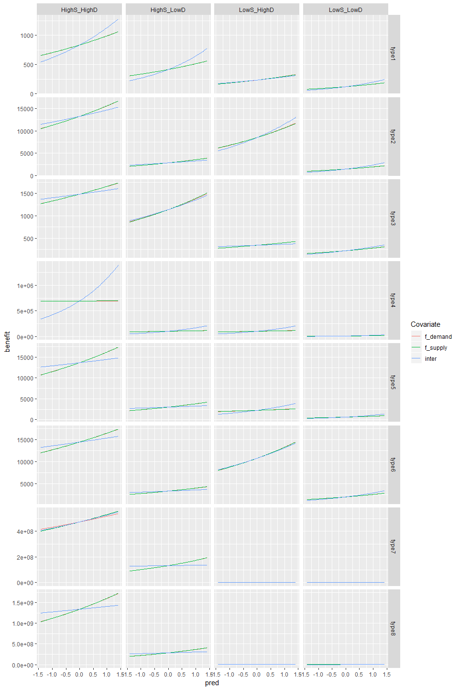
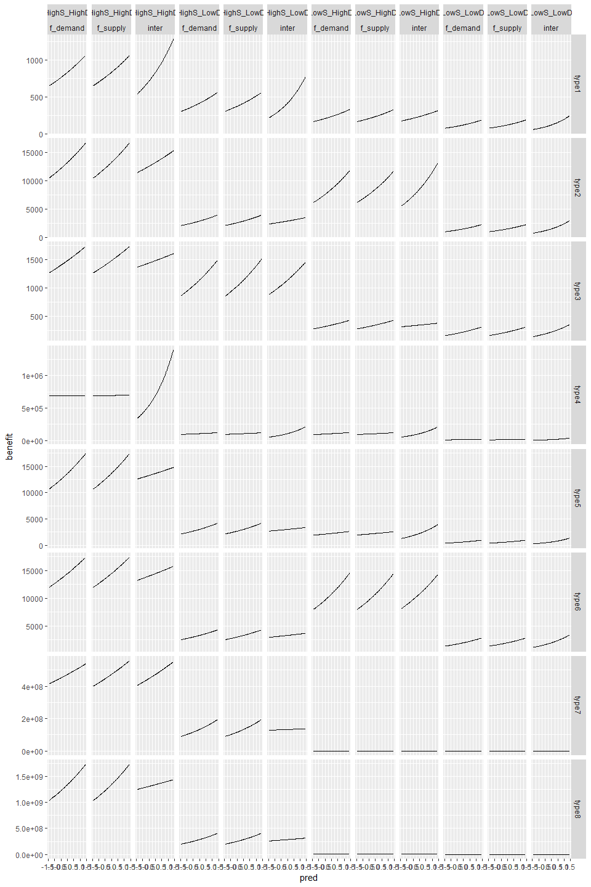
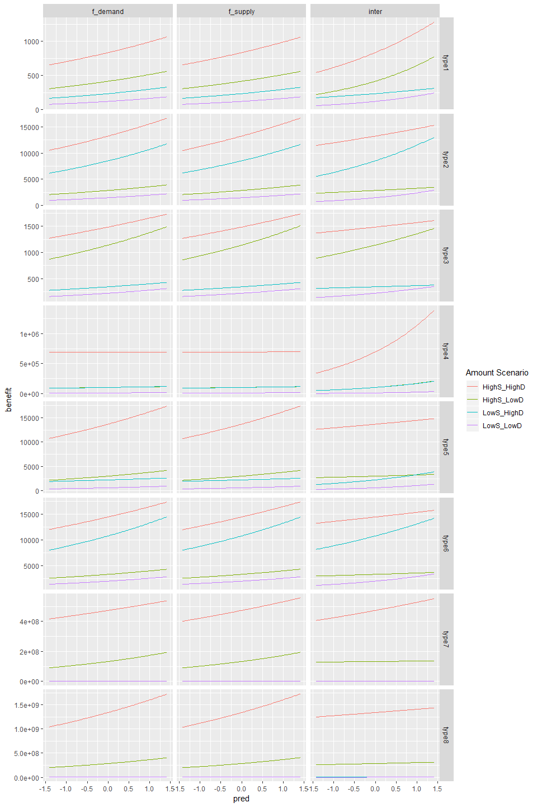

Benefit Plots
================

In this document, we analyse the results of the simulations generated using `es_benefit.R`.

Typologies
----------

In the below plots, the service types are numbered left-to-right, top-to-bottom (e.g. type one is plantation forestry, type 5 is wind pollinated crops/hunting etc.).

Sensitivity to landscape configuration parameters
-------------------------------------------------

For each subgroup (unique combinations of ES type based on service scenario), we fit a Poisson GLM with the landscape parameters as covariates (f\_supply, f\_demand, inter, amt\_scenario). We also include the interaction between each configuration parameter (f\_supply, f\_demand, inter) and the amount scenario to get an idea of whether the relationship between landscape configuration and ES benefit changes with landscape composition.

The plots below are partial effect plots for the landscape configuration variables at each level of amount scenario.

NB The relationship between ES benefit and both fragmentation parameters is pretty similar, this is why f\_demand lines are not visible. This is something worth discussing (e.g. is this to do with the way we have written the benefit function, or is it an actual result).

Below are a couple of other ways to cut the visualisation

