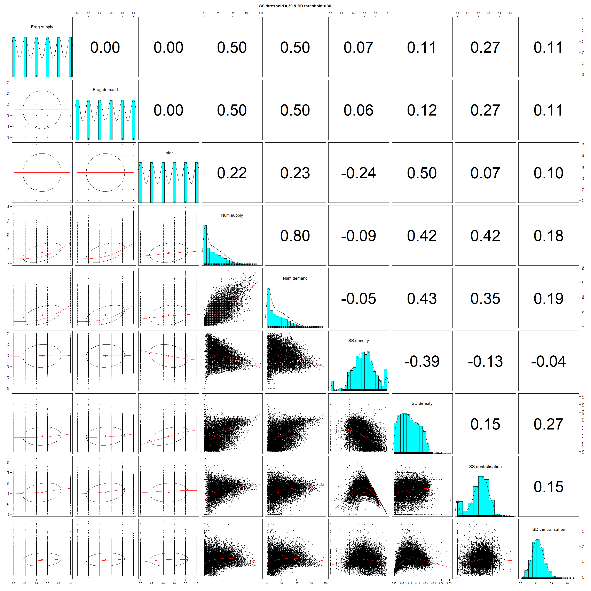
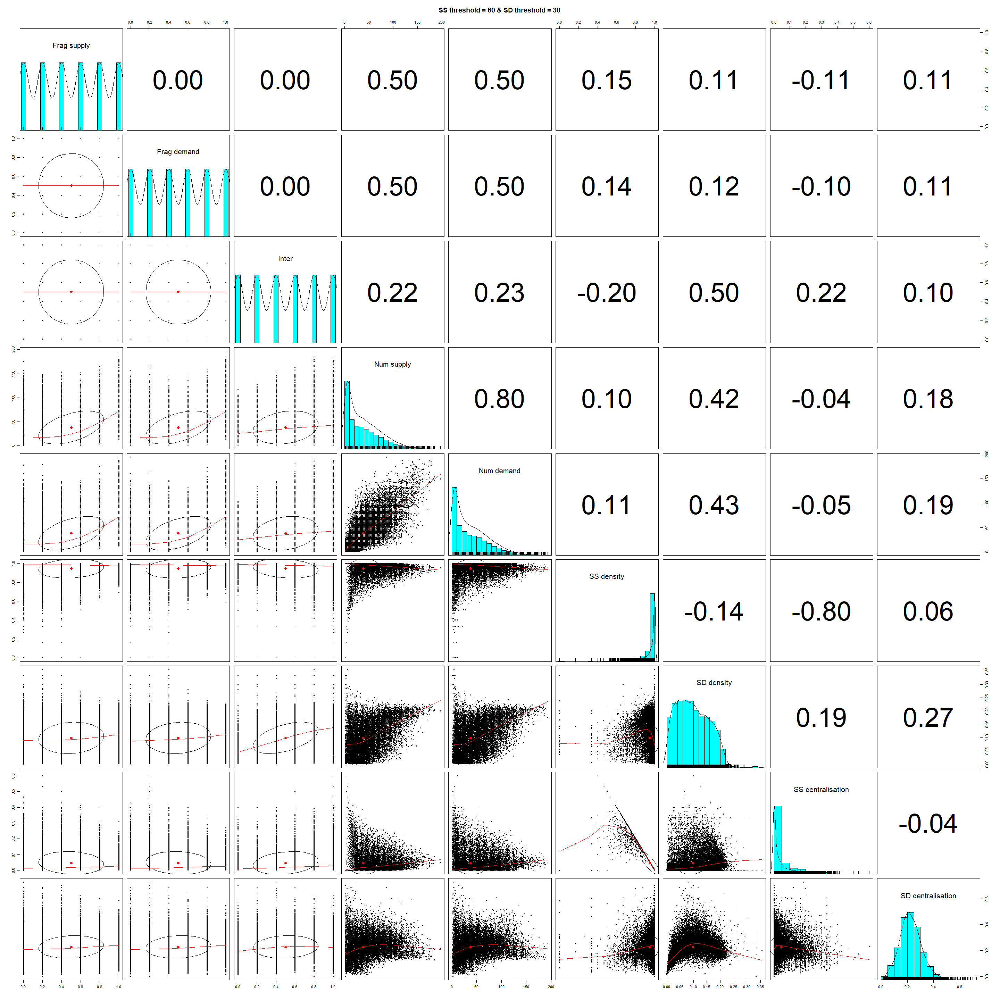
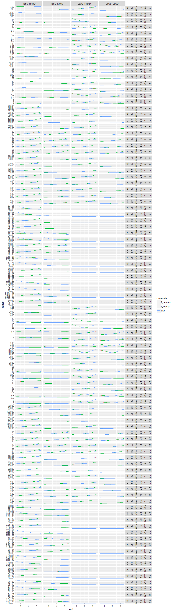

Benefit Plots
================

## Introduction

In this document, we analyse the results of the simulations generated
using `es_benefit.R`.

``` r
load("results/benefit_all_replicates.rda")
```

``` r
res <- out %>%
  mutate(amt_scenario = case_when(p_supply == 0.1 & p_demand == 0.1 ~ "S = 10% D = 10%",
                                  p_supply == 0.4 & p_demand == 0.1 ~ "S = 40% D = 10%",
                                  p_supply == 0.1 & p_demand == 0.4 ~ "S = 10% D = 40%",
                                  p_supply == 0.4 & p_demand == 0.4 ~ "S = 40% D = 40%",
                                  TRUE ~ "None")) %>%
  select(amt_scenario, alpha, beta, gamma, rival, ee_thresh, es_thresh, f_supply, f_demand, inter, benefit, num_supply, ee_density, ee_centr_degree, ee_edge_per_node_mean, num_demand, es_density, es_centr_degree, es_edge_per_node_mean)
```

## Hypotheses development

Based on simulated results, we quantify the effect of landscape
structure across four dimensions: (1) the amount of supply, (2) the
amount of demand, (3) fragmentation of supply, (4) fragmentation of
demand, and (5) supply/demand interspersion.

Then we develop hypotheses for how these effects vary across six
dimensions of ecosystem service characteristics: (1) the scaling effect
of whether supply-supply connections are spatially constrained or
unconstrained relative to the landscape size, (2) the scaling effect of
whether supply-demand connections are spatially constrained or
unconstrained relative to the landscape size, (3) whether ecosystem
service supply scales with patch size linearly or according to a
species-area relationship, (4) whether supply-supply connections have a
positive, negative or no effect on ecosystem service supply, (5) whether
the ecosystem service is substitutable or not, and (6) whether the
ecosystem service is rival or not.

First we define functions to fit statistical models to the simulated
benefit data and extract coefficient estimates. The model we define here
is a Poisson glm with a “quasipoisson” family.

``` r
# change here to change model structure
mod_fit <- function(dat) {
  glm(benefit ~ f_supply * inter + f_demand * inter + f_supply * f_demand + I(f_supply ^ 2) + I(f_demand ^ 2) + I(inter ^ 2), data = dat, family = "quasipoisson")
}

# change here to change the variables that are scaled
scale_cols <- function(x) {
  scale_this <- function(y) as.vector(scale(y))
  mutate_at(x, .vars = vars(f_supply, f_demand, inter), .funs = funs(scale_this))
}

# change covariates and arrange() here if model structure changes for getting coefficients and standard errors
get_coefs <- function(mod) {
  data.frame(covariates = c("(Intercept)", "Frag supply", "Inter", "Frag demand", "Frag supply ^ 2", "Frag demand ^ 2", "Inter ^ 2", "Frag supply * Inter", "Frag demand * Inter", "Frag supply * Frag demand"), estimates = summary(mod)$coefficients[,1], serrors = summary(mod)$coefficients[,2]) %>% as_tibble() %>% arrange(c(1 ,2 , 6, 4, 3, 5, 7, 9, 10, 8))  
}
```

Next we fit the models to each combination scenario of amount of supply
and demand (amt\_scenario), spatial scale of supply-supply links
(ee\_thresh), spatial scale of supply-demand links (es\_thresh), the
effect of supply-supply connections on ecosystem service supply (beta),
substitutability of the service (gamma), and rivalness (rival). Note for
now we assume that ecosystem service supply scales with patch size
according to a species-area relationship - the next iteration will
consider the consequences of a linear relationship.

``` r
mod <- res %>%
  group_by(amt_scenario, ee_thresh, es_thresh, beta, gamma, rival) %>%
  nest() %>%
  mutate(data_scaled = map(data, scale_cols),
         mod = map(data_scaled, mod_fit),
         mod_tidy = map(mod, tidy),
         mod_glance = map(mod, glance),
         mod_coefs = map(mod, get_coefs))

effects <- mod %>% select(ee_thresh, es_thresh, amt_scenario, beta, gamma, rival, mod_coefs) %>%
unnest()         
```

To visualise the results we generate plots the coefficients (effect
sizes) for different combinations of the scaling of supply-supply and
supply-demand links, how ecosystem service supply scales with patch
area, and the effect of supply-supply connections on ecosystem service
supply. We first do this for a substitutable and non-rival ecosystem
service and then explore how the patterns change for a rival or a
non-substitutable ecosystem service.

### Substitutable and non-rival ecosystem service

Below we show, for a substitutable and non-rival ecosystem service, the
effect of landscape structure for different spatial scaling of
supply-supply (ee\_thresh) and supply-demand links (es\_thresh) and the
effect of supply-supply connections on ecosystem service supply (beta).
The units of ee\_thresh and es\_thresh are in cells, and the size of the
landscape is 65 x 65 cells (approximately 92 cells from corner to
corner). Note here we currently ignore the different ways in which patch
size may influence ecosystem service supply pending further
simulations.

<!-- -->

In the case we observe the following as potential hypotheses:

1)  In general, the effect of fragmentation of supply or demand is
    positive, except when supply-supply connectivity has a negative
    effect on ecosystem service supply and the scale of supply-supply
    threshold that defines links is large (i.e., 60).

In the first plot below (scale of supply-supply links = 30 and amount of
supply and demand = 10%) you can see that fragmentation tends to
increase the density of network connections between supply and supply
nodes, but also increases centralisation of the supply-supply network.
This means that as the landscape is fragmented, despite and increase in
the density of supply-supply links they are shared among only a few
nodes (i.e., the network essentially becomes more fragmented). However,
in the second plot below you can see that, when the scale of
supply-supply links = 60, centralisation decreases with fragmentation,
so the increase in the density of supply-supply links is shared among
nodes (i.e., the network essentially becomes less fragmented). This may
explain why, when the effects of supply-supply connections on ecosystem
service supply is negative, you get a positive effect of fragmentation
when the scale of supply-supply links is small (30), but is negative
when the scale of supply-supply links is large (60).

<!-- -->
<!-- -->

# Laura’s previous stuff

## Typologies

This typology needs updating to reflect the new typology in the
manuscript, but left here for now.

<!-- -->

In the below plots, the service types are numbered left-to-right,
top-to-bottom (e.g. type one is plantation forestry, type 5 is wind
pollinated crops/hunting etc.).

## Sensitivity to landscape configuration parameters

For each subgroup (unique combinations of ES type based on service
scenario), we fit a Poisson GLM with the landscape parameters as
covariates (f\_supply, f\_demand, inter, amt\_scenario). We also include
the interaction between each configuration parameter (f\_supply,
f\_demand, inter) and the amount scenario to get an idea of whether the
relationship between landscape configuration and ES benefit changes with
landscape composition.

The plots below are partial effect plots for the landscape configuration
variables at each level of amount scenario.

``` r
# change here to change model structure
mod_fit <- function(dat) {
  glm(benefit ~ f_supply * amt_scenario + f_demand * amt_scenario + inter * amt_scenario, data = dat, family = "poisson")
}

# change here to change variables that are scaled
scale_cols <- function(x) {
  scale_this <- function(y) as.vector(scale(y))
  mutate_at(x, .vars = vars(f_supply, f_demand, inter), .funs = funs(scale_this))
}

# change here if model structure changes
get_preds <- function(mod, pred) {
  make_predictions(mod, pred = pred, modx = "amt_scenario")$predicted %>%
    mutate(covariate = pred) %>%
    select(benefit, pred = !!pred, modx_group, covariate)
}

get_all_preds <- function(mod) {
  get_preds(mod, "f_supply") %>%
    bind_rows(get_preds(mod, "f_demand")) %>%
    bind_rows(get_preds(mod, "inter"))
}
```

<!-- -->

NB The relationship between ES benefit and both fragmentation parameters
is pretty similar, this is why f\_demand lines are not visible. This is
something worth discussing (e.g. is this to do with the way we have
written the benefit function, or is it an actual result).

Below are a couple of other ways to cut the visualisation \[NOTE: SEEMS
TO CURRENTLY BE AN ISSUE WITH THIS CODE - NOT PRESENTLY EVALUATED\]

``` r
ggplot(preds, aes(x = pred, y = benefit)) +
  geom_line() +
  facet_grid(service_scenario ~ modx_group + covariate, scales = "free")
```

``` r
ggplot(preds, aes(x = pred, y = benefit, colour = modx_group)) +
  geom_line() +
  scale_color_discrete(name = "Amount Scenario") +
  facet_grid(service_scenario ~ covariate, scales = "free")
```
