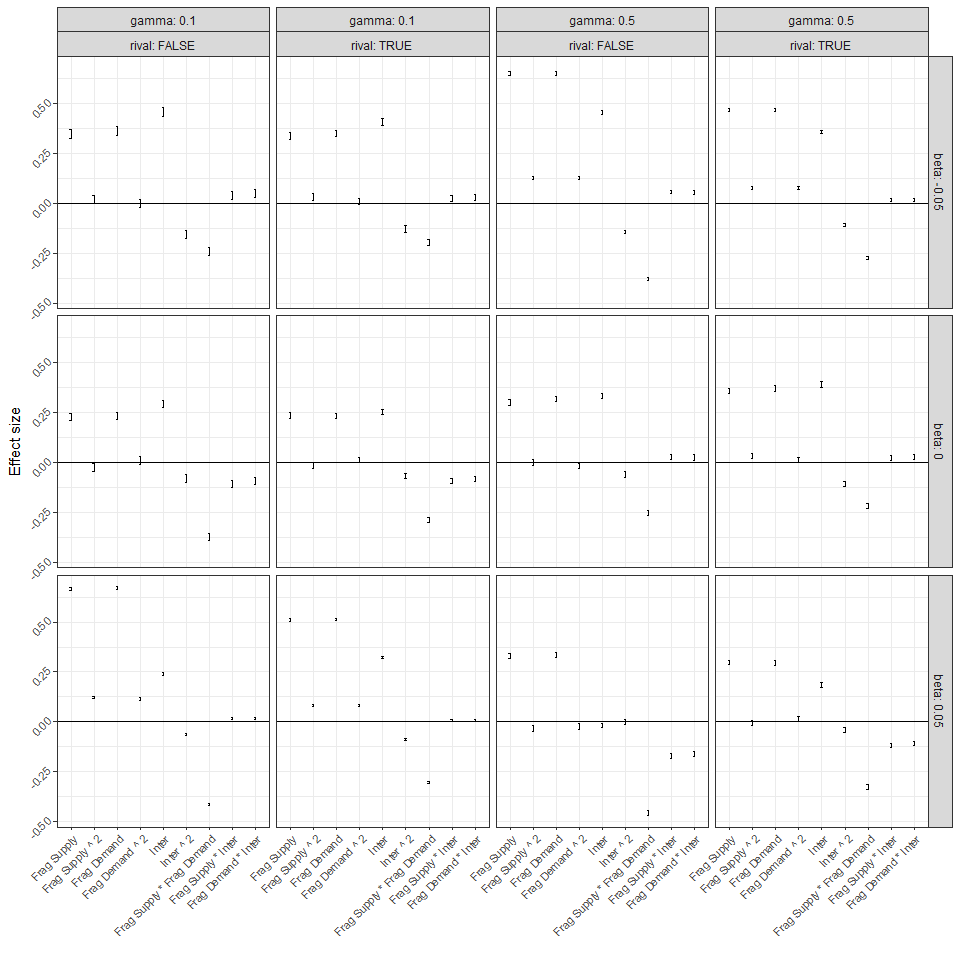

Benefit Plots
================

## Introduction

In this document, we analyse the results of the simulations generated
using `es_benefit.R`.

## Hypotheses development

Here, based on simulated results, we develop hypotheses about the effect
of landscape structure across four dimensions: (1) the amount of supply,
(2) the amount of demand, (3) fragmentation of supply, (4) fragmentation
of demand, and (5) supply/demand interspersion.

Then we develop hypotheses for how these effects vary across five
dimensions of ecosystem service characteristics: (1) whether
supply-supply connections are spatially constrained or unconstrained,
(2) whether supply-demand connection are spatially constrained or
unconstrained, (3) whether supply-supply connectivity has a positive,
negative or no effect on ecosystem service supply, (4) ecosystem service
substitutability, and (5) ecosystem service rivalness.

First we define functions to fit the models and extract coefficient
estimates. The model we fit here is a Poisson glm with a “quasipoisson”
family.

``` r
# change here to change model structure
mod_fit <- function(dat) {
  glm(benefit ~ f_supply * inter + f_demand * inter + f_supply * f_demand + I(f_supply ^ 2) + I(f_demand ^ 2) + I(inter ^ 2), data = dat, family = "quasipoisson")
}

# change here to change variables that are scaled
scale_cols <- function(x) {
  scale_this <- function(y) as.vector(scale(y))
  mutate_at(x, .vars = vars(f_supply, f_demand, inter), .funs = funs(scale_this))
}

# change covariates and arrange() here if model structure changes for getting coefficients and standard errors
get_coefs <- function(mod) {
  data.frame(covariates = c("(Intercept)", "Frag Supply", "Inter", "Frag Demand", "Frag Supply ^ 2", "Frag Demand ^ 2", "Inter ^ 2", "Frag Supply * Inter", "Frag Demand * Inter", "Frag Supply * Frag Demand"), estimates = summary(mod)$coefficients[,1], serrors = summary(mod)$coefficients[,2]) %>% as_tibble() %>% arrange(c(1 ,2 , 6, 4, 3, 5, 7, 9, 10, 8))  
}
```

Next we fit the models to each amt\_scenario, ee\_thresh, es\_thresh,
beta, gamma, and rival combinations

``` r
mod <- res %>%
  group_by(amt_scenario, ee_thresh, es_thresh, beta, gamma, rival) %>%
  nest() %>%
  mutate(data_scaled = map(data, scale_cols),
         mod = map(data_scaled, mod_fit),
         mod_tidy = map(mod, tidy),
         mod_glance = map(mod, glance),
         mod_coefs = map(mod, get_coefs))

effects <- mod %>% select(ee_thresh, es_thresh, amt_scenario, beta, gamma, rival, mod_coefs) %>%
unnest()         
```

Next we plot the coefficients (effect sizes) for different combinations
of values for: (1) the effect of connectivity on ecosystem service
supply (beta), (2) ecosystem service substitutability (gamma), and (3)
rivalness (rival).

We do this for each amount scenario (i.e., amounts of supply and demand)
and each spatial scale of supply-supply and supply-demand connections
(i.e., whether connections are spatially constrined or
not)

### LowS-LowD, scale of SS connections = 30, scale of SD connections = 30

In this case we observe the following:

1)  The effect of supply fragmentation, fragmentation of demand and
    interspersion are always positive. This seems to arise because
    fragmentation tends to connect patches up (as measured by the edge
    density) and interspersion tends to connect supply and demand
    patches.

2)  When the ES is substitutable (gamma = 0.1) then the effect of supply
    or demand fragmentation is higher when the effect of supply-supply
    connections are positive (beta = 0.05) than when the effect of
    supply-supply connections are negative (beta = -0.05). However, when
    ES is non-substitutable (gamma = 0.5) these effects are the other
    way around (i.e., the effect of supply or demand fragmentation is
    higher when the effect of supply-supply connections are negative
    (beta = -0.05) than when the effect of supply-supply connections are
    positive (beta = 0.05)). This may be explained by the following:
    When the ES is substitutable marginal values do not change very much
    so effects closely reflect changes in supply - greater fragmentation
    leads to more supply-supply connections (as measured by edge
    density) and this maximises the supply of the ES when the effects of
    supply-supply connections is positive. When the ES is not
    substitutable, there is a cost to fragmenting supply as it also
    leads to connecting supply and demand patches and reduces the
    marginal value of the service rapidly.

3)  The effect of interspersion is greater than the effect of
    fragmentation, except when the ES is non-substitutable (gamma = 0.5)
    or when supply-supply connections have a positive effect on supply
    (beta = 0.05). This could be explained by two processes: (a) when
    the ES is non-substitutable there is some cost to connecting demand
    to supply patches as it reduces the marginal value of the service
    rapidly, (b) when supply-supply connections have a positive effect
    on supply then interspersion tends to reduce the number of
    supply-supply connections by spreading out supply patches.

4)  There is a strong negative interaction between supply and demand
    fragmentation (i.e., the effect of supply fragmentation declines as
    demand fragmentation increases and vice versa). This interaction
    effect seems to be smallest when the effect of supply-supply links
    is negative.

5)  In general being rival tends to reduce the effect of landscape
    structure variables on benefits (although the effects seems to be a
    bit variable and not large).

6)  The effect of interspersion is non-linear with maximum effects at
    intermediate values of interspersion (i.e., the main effect is
    positive and the quadratic effect is
negative)

<!-- -->

### HighS-LowD, scale of SS connections = 30, scale of SD connections = 30

In this case we observe similar patterns to the LowS-LowD case except
for the following:

1)  In general the effects of landscape structure are smaller than in
    the LowS-LowD case.

2)  When the effect of supply-supply connection are positive and the ES
    is non-substitutable then the effect of interspersion is negative.
    Presumably this reflects the rapid decline in marginal values as you
    connect supply and demand patches (see comments
above).

<!-- -->

### LowS-HighD, scale of SS connections = 30, scale of SD connections = 30

In this case we observe similar patterns to the LowS-LowD case except
for the following:

1)  In general the effects of landscape structure are smaller than in
    the LowS-LowD case.

2)  Interspersion tends not to have effects any bigger then suppy and
    demand fragmentation.

<!-- -->

# Laura’s previous stuff

## Typologies

This typology needs updating to reflect the new typology in the
manuscript, but left here for now.

<!-- -->

In the below plots, the service types are numbered left-to-right,
top-to-bottom (e.g. type one is plantation forestry, type 5 is wind
pollinated crops/hunting etc.).

## Sensitivity to landscape configuration parameters

For each subgroup (unique combinations of ES type based on service
scenario), we fit a Poisson GLM with the landscape parameters as
covariates (f\_supply, f\_demand, inter, amt\_scenario). We also include
the interaction between each configuration parameter (f\_supply,
f\_demand, inter) and the amount scenario to get an idea of whether the
relationship between landscape configuration and ES benefit changes with
landscape composition.

The plots below are partial effect plots for the landscape configuration
variables at each level of amount scenario.

``` r
# change here to change model structure
mod_fit <- function(dat) {
  glm(benefit ~ f_supply * amt_scenario + f_demand * amt_scenario + inter * amt_scenario, data = dat, family = "poisson")
}

# change here to change variables that are scaled
scale_cols <- function(x) {
  scale_this <- function(y) as.vector(scale(y))
  mutate_at(x, .vars = vars(f_supply, f_demand, inter), .funs = funs(scale_this))
}

# change here if model structure changes
get_preds <- function(mod, pred) {
  make_predictions(mod, pred = pred, modx = "amt_scenario")$predicted %>%
    mutate(covariate = pred) %>%
    select(benefit, pred = !!pred, modx_group, covariate)
}

get_all_preds <- function(mod) {
  get_preds(mod, "f_supply") %>%
    bind_rows(get_preds(mod, "f_demand")) %>%
    bind_rows(get_preds(mod, "inter"))
}
```

<!-- -->

NB The relationship between ES benefit and both fragmentation parameters
is pretty similar, this is why f\_demand lines are not visible. This is
something worth discussing (e.g. is this to do with the way we have
written the benefit function, or is it an actual result).

Below are a couple of other ways to cut the visualisation \[NOTE: SEEMS
TO CURRENTLY BE AN ISSUE WITH THIS CODE - NOT PRESENTLY EVALUATED\]

``` r
ggplot(preds, aes(x = pred, y = benefit)) +
  geom_line() +
  facet_grid(service_scenario ~ modx_group + covariate, scales = "free")
```

``` r
ggplot(preds, aes(x = pred, y = benefit, colour = modx_group)) +
  geom_line() +
  scale_color_discrete(name = "Amount Scenario") +
  facet_grid(service_scenario ~ covariate, scales = "free")
```
