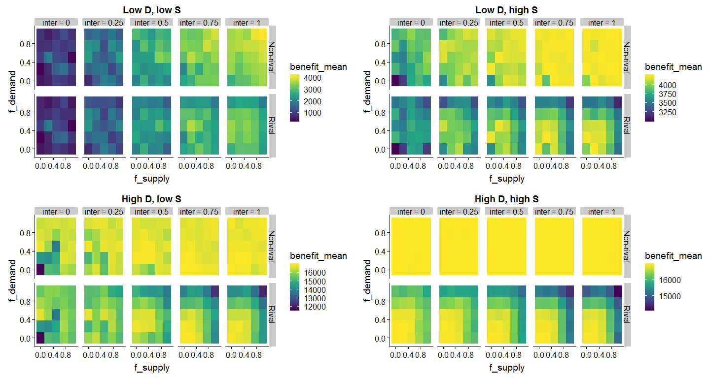
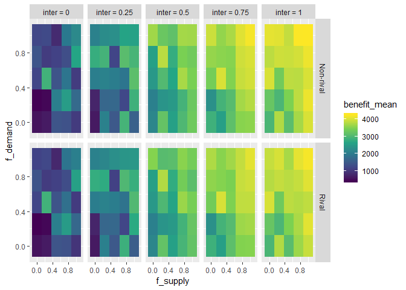
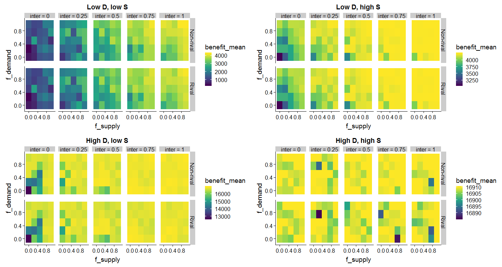
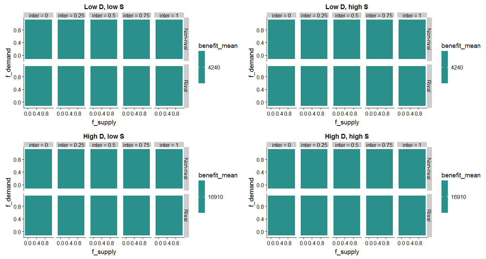
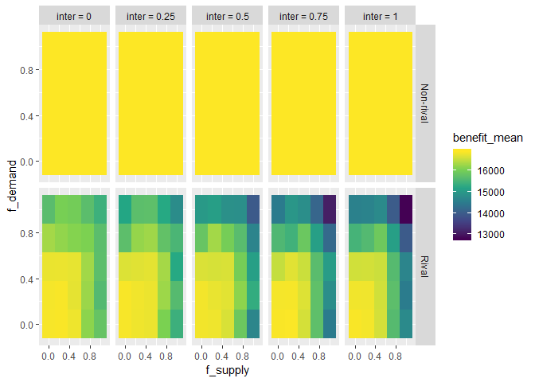
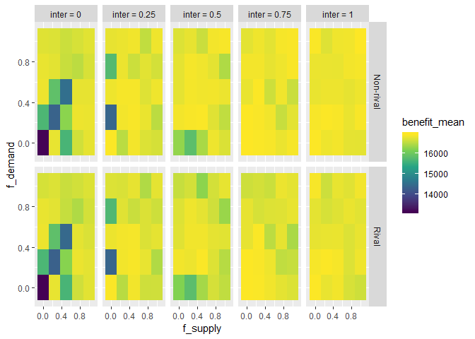
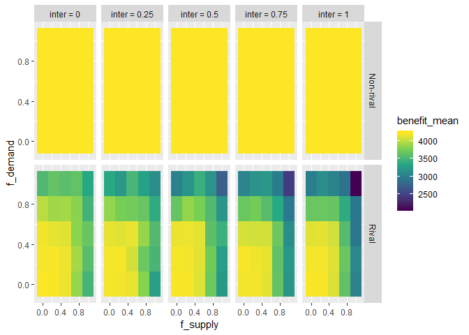
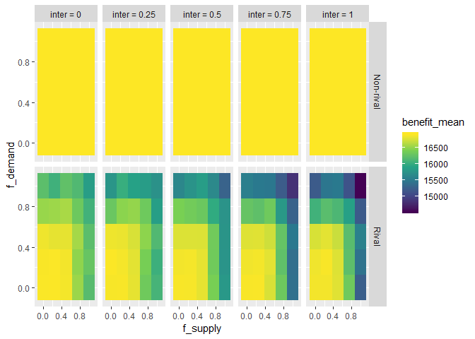
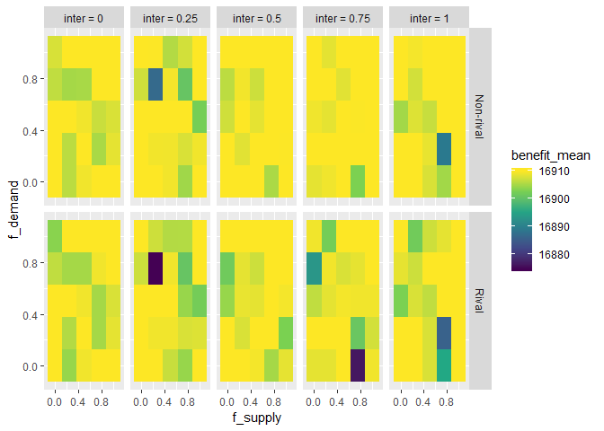
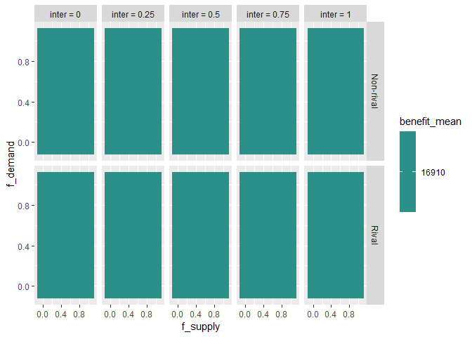

Load results of the simulations (`sim_benefit.R`). We filter the results to only take benefit function values $\alpha = 1, \beta = 0.1, \gamma = 0.1$.  

# Low supply (0.1), Low demand (0.1)

## Low S, low D: No supply-supply links, proximal supply-demand links
<!-- -->

## Low S, low D: No supply-supply links, full supply-demand links
<!-- -->

## Low S, low D: Proximal supply-supply links, proximal supply-demand links
<!-- -->

## Low S, low D: Proximal supply-supply links, full supply-demand links
<!-- -->

## Low S, low D: Full supply-supply links, full supply-demand links
<!-- -->

# Low supply (0.1), high demand (0.4)

## Low S, high D: No supply-supply links, proximal supply-demand links
<!-- -->

## Low S, high D: No supply-supply links, full supply-demand links
<!-- -->

## Low S, high D: Proximal supply-supply links, proximal supply-demand links
<!-- -->

## Low S, high D: Proximal supply-supply links, full supply-demand links
<!-- -->

## Low S, high D: Full supply-supply links, full supply-demand links
<!-- -->

# High supply (0.4), low demand (0.1)

## High S, low D: No supply-supply links, proximal supply-demand links
<!-- -->

## High S, low D: No supply-supply links, full supply-demand links
<!-- -->

## High S, low D: Proximal supply-supply links, proximal supply-demand links
<!-- -->

## High S, low D: Proximal supply-supply links, full supply-demand links
<!-- -->

## High S, low D: Full supply-supply links, full supply-demand links
<!-- -->

# High supply (0.4), high demand (0.4)

## High S, high D: No supply-supply links, proximal supply-demand links
<!-- -->

## High S, high D: No supply-supply links, full supply-demand links
<!-- -->

## High S, high D: Proximal supply-supply links, proximal supply-demand links
<!-- -->

## High S, high D: Proximal supply-supply links, full supply-demand links
<!-- -->

## High S, high D: Full supply-supply links, full supply-demand links
<!-- -->
