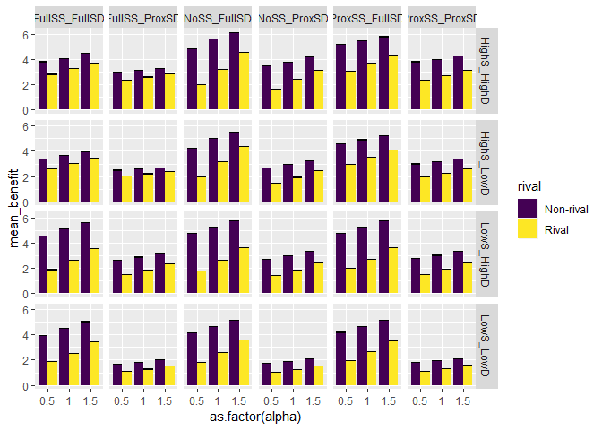
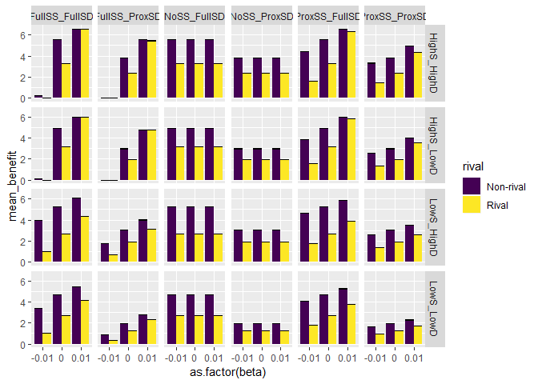
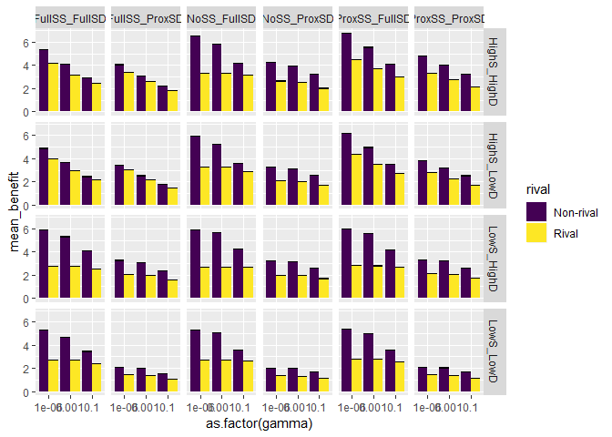
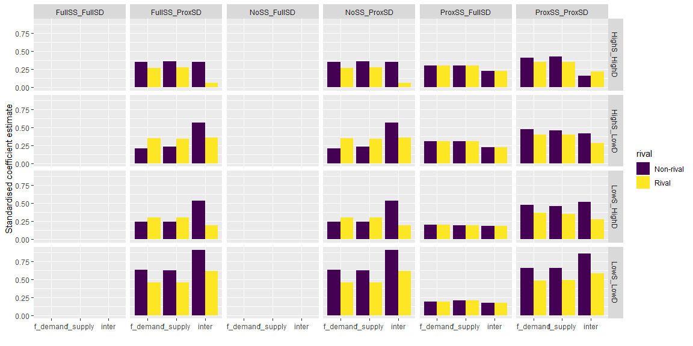
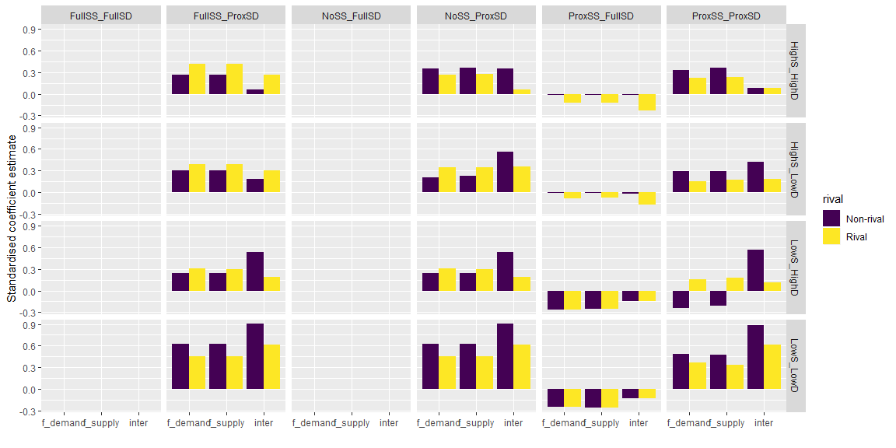
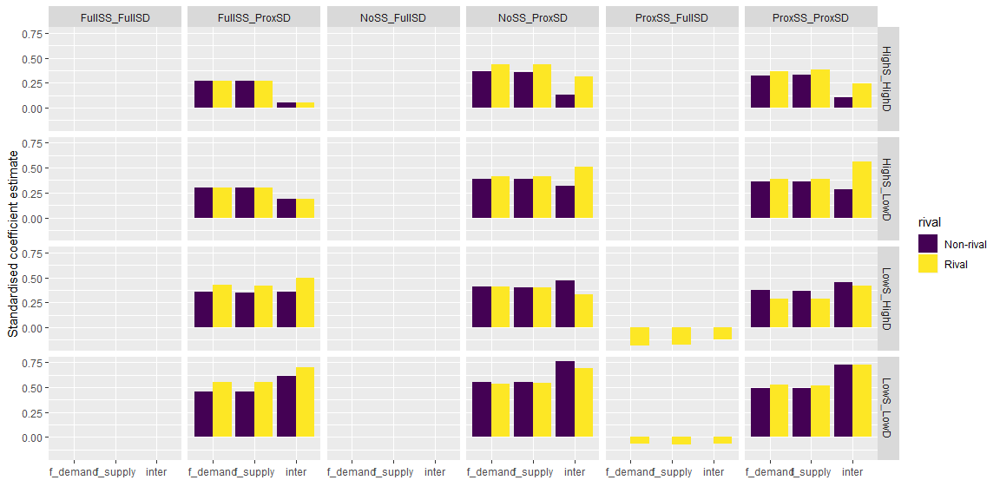

Benefit Plots
================

In this document, we analyse the results of the simulations generated using `es_benefit.R`.

Sensitivity to benefit function parameters
------------------------------------------

First, we will take a look at the mean and variability (by standard error) of the benefit value for the different benefit function parameters. This will give us an idea of how sensitive the calculation is to values of *α*, *β* and *γ*. NB in all cases, plots and models show log10(*b**e**n**e**f**i**t*) due to the large disparity between scenarios.

### Sensitivity to *α*

Rate at which service supply varies with area: *α* ≥ 0 determines whether the service supply increases less rapidly than area (*α* &lt; 1), linearly with area (*α* = 1), or more rapidly than area (*α* &gt; 1).

    ##              Df Sum Sq Mean Sq F value   Pr(>F)    
    ## alpha         1  20.69   20.69   21.72 7.26e-06 ***
    ## rival         1  66.26   66.26   69.56 6.29e-14 ***
    ## alpha:rival   1   1.39    1.39    1.46    0.229    
    ## Residuals   140 133.35    0.95                     
    ## ---
    ## Signif. codes:  0 '***' 0.001 '**' 0.01 '*' 0.05 '.' 0.1 ' ' 1

    ##                     Df Sum Sq Mean Sq F value   Pr(>F)    
    ## alpha                1  20.69  20.690  15.578 0.000126 ***
    ## amt_scenario         3  20.16   6.719   5.059 0.002363 ** 
    ## alpha:amt_scenario   3   0.20   0.067   0.050 0.984992    
    ## Residuals          136 180.63   1.328                     
    ## ---
    ## Signif. codes:  0 '***' 0.001 '**' 0.01 '*' 0.05 '.' 0.1 ' ' 1

    ##                      Df Sum Sq Mean Sq F value   Pr(>F)    
    ## alpha                 1  20.69  20.690  24.290 2.44e-06 ***
    ## link_scenario         5  84.72  16.944  19.893 9.61e-15 ***
    ## alpha:link_scenario   5   3.84   0.768   0.901    0.482    
    ## Residuals           132 112.43   0.852                     
    ## ---
    ## Signif. codes:  0 '***' 0.001 '**' 0.01 '*' 0.05 '.' 0.1 ' ' 1

Key results:

-   *α* has a positive effect on mean service benefit.
-   *α* has more effect than the amount or link scenarios, but less effect than rival/non-rival.
-   *α* are no interactions between the effect of alpha and the effect of the scenarios (at the first-order interaction level).

### Sensitivity to *β*

*β* is the amount that the service supply changes per unit area of the supply nodes that the focal node is connected to (i.e., the effect of connectivity on service supply). This can have a negative effect of connected supply (*β* &lt; 0), no effect of connected supply (*β* = 0) or a positive effect of connected supply (*β* &gt; 0).

    ##              Df Sum Sq Mean Sq F value   Pr(>F)    
    ## beta          1  95.27   95.27  57.357 4.47e-12 ***
    ## rival         1  66.26   66.26  39.892 3.34e-09 ***
    ## beta:rival    1   1.42    1.42   0.853    0.357    
    ## Residuals   140 232.53    1.66                     
    ## ---
    ## Signif. codes:  0 '***' 0.001 '**' 0.01 '*' 0.05 '.' 0.1 ' ' 1

    ##                    Df Sum Sq Mean Sq F value   Pr(>F)    
    ## beta                1  95.27   95.27  48.851 1.13e-10 ***
    ## amt_scenario        3  20.16    6.72   3.446   0.0186 *  
    ## beta:amt_scenario   3  14.83    4.94   2.534   0.0595 .  
    ## Residuals         136 265.22    1.95                     
    ## ---
    ## Signif. codes:  0 '***' 0.001 '**' 0.01 '*' 0.05 '.' 0.1 ' ' 1

    ##                     Df Sum Sq Mean Sq F value   Pr(>F)    
    ## beta                 1  95.27   95.27   85.31 5.63e-16 ***
    ## link_scenario        5  84.72   16.94   15.17 9.18e-12 ***
    ## beta:link_scenario   5  68.07   13.61   12.19 1.01e-09 ***
    ## Residuals          132 147.41    1.12                     
    ## ---
    ## Signif. codes:  0 '***' 0.001 '**' 0.01 '*' 0.05 '.' 0.1 ' ' 1

Key results:

-   *β* has a positive effect on service benefit.
-   This effect is not present when there are no supply-supply links.
-   This means that there is an interactive effect of *β* and link scenario, but no other interactive effects.
-   *β* has a greater effect on service benefit than any of the scenarios.

### Sensitivity to *γ*

*γ* &gt; 0 is the rate of exponential decline in the marginal utility with increasing supply.

    ##              Df Sum Sq Mean Sq F value   Pr(>F)    
    ## gamma         1  26.76   26.76  26.076 1.05e-06 ***
    ## rival         1  66.26   66.26  64.558 3.50e-13 ***
    ## gamma:rival   1   4.18    4.18   4.068   0.0456 *  
    ## Residuals   140 143.68    1.03                     
    ## ---
    ## Signif. codes:  0 '***' 0.001 '**' 0.01 '*' 0.05 '.' 0.1 ' ' 1

    ##                     Df Sum Sq Mean Sq F value   Pr(>F)    
    ## gamma                1  26.76  26.762  18.992 2.57e-05 ***
    ## amt_scenario         3  20.16   6.719   4.768  0.00342 ** 
    ## gamma:amt_scenario   3   2.32   0.772   0.548  0.65038    
    ## Residuals          136 191.64   1.409                     
    ## ---
    ## Signif. codes:  0 '***' 0.001 '**' 0.01 '*' 0.05 '.' 0.1 ' ' 1

    ##                      Df Sum Sq Mean Sq F value   Pr(>F)    
    ## gamma                 1  26.76  26.762  27.835 5.27e-07 ***
    ## link_scenario         5  84.72  16.944  17.623 2.39e-13 ***
    ## gamma:link_scenario   5   2.48   0.497   0.517    0.763    
    ## Residuals           132 126.91   0.961                     
    ## ---
    ## Signif. codes:  0 '***' 0.001 '**' 0.01 '*' 0.05 '.' 0.1 ' ' 1

-   Effects of *γ* seem a little more complicated.
-   When it has an effect, the effect of *γ* is negative.
-   There is an interaction between *γ* and rival/non-rival, but this interaction seems affected by link, and perhaps amount scenarios too. See below.

<!-- -->

    ##                                        Df Sum Sq Mean Sq F value   Pr(>F)
    ## gamma                                   1  26.76   26.76 159.378  < 2e-16
    ## rival                                   1  66.26   66.26 394.592  < 2e-16
    ## link_scenario                           5  84.72   16.94 100.910  < 2e-16
    ## amt_scenario                            3  20.16    6.72  40.017 4.16e-13
    ## gamma:rival                             1   4.18    4.18  24.864 8.44e-06
    ## gamma:link_scenario                     5   2.48    0.50   2.958  0.02089
    ## rival:link_scenario                     5  10.31    2.06  12.277 1.09e-07
    ## gamma:amt_scenario                      3   2.32    0.77   4.598  0.00658
    ## rival:amt_scenario                      3   2.83    0.94   5.625  0.00219
    ## link_scenario:amt_scenario             15   6.57    0.44   2.609  0.00605
    ## gamma:rival:link_scenario               5   2.37    0.47   2.828  0.02565
    ## gamma:rival:amt_scenario                3   0.11    0.04   0.219  0.88306
    ## gamma:link_scenario:amt_scenario       15   0.38    0.03   0.150  0.99987
    ## rival:link_scenario:amt_scenario       15   3.16    0.21   1.254  0.26765
    ## gamma:rival:link_scenario:amt_scenario 15   0.21    0.01   0.084  1.00000
    ## Residuals                              48   8.06    0.17                 
    ##                                           
    ## gamma                                  ***
    ## rival                                  ***
    ## link_scenario                          ***
    ## amt_scenario                           ***
    ## gamma:rival                            ***
    ## gamma:link_scenario                    *  
    ## rival:link_scenario                    ***
    ## gamma:amt_scenario                     ** 
    ## rival:amt_scenario                     ** 
    ## link_scenario:amt_scenario             ** 
    ## gamma:rival:link_scenario              *  
    ## gamma:rival:amt_scenario                  
    ## gamma:link_scenario:amt_scenario          
    ## rival:link_scenario:amt_scenario          
    ## gamma:rival:link_scenario:amt_scenario    
    ## Residuals                                 
    ## ---
    ## Signif. codes:  0 '***' 0.001 '**' 0.01 '*' 0.05 '.' 0.1 ' ' 1

Sensitivity to landscape configuration parameters
-------------------------------------------------

In this section, for each subgroup (unique combinations of ES type based on link scenario, amount scenario, rival/non-rival and benefit function parameters), we fit a Poisson GLM with the landscape configuration parameters as covariates (f\_supply, f\_demand, inter). We will present the results from three combinations of the benefit function parameters (for now):

-   *α* = 1, *β* = −0.01, *γ* = 0.000001 (linear effect of supply, negative effect of connected supply, next to no exponential decline of marginal utility)
-   *α* = 1, *β* = 0.01, *γ* = 0.000001 (linear effect of supply, positive effect of connected supply, next to no exponential decline of marginal utility)
-   *α* = 1, *β* = 0.01, *γ* = 0.1 (linear effect of supply, negative effect of connected supply, large exponential decline of marginal utility)

We can try other values, but this was to get an idea of how results change depending on the benefit function parameter values. *α* had least impact on outcomes (*γ* the most), hence we've fixed this value.

To avoid swamping the results or ending up with very complicated interaction combinations to interpret, I chose to model as subsets for now. We may wish to revisit this in a more robust full data analysis with interactions.

### Benefit function combination one

*α* = 1, *β* = −0.01, *γ* = 0.000001 (linear effect of supply, negative effect of connected supply, next to no exponential decline of marginal utility)

### Benefit function combination two

*α* = 1, *β* = 0.01, *γ* = 0.000001 (linear effect of supply, positive effect of connected supply, next to no exponential decline of marginal utility)

### Benefit function combination three

*α* = 1, *β* = 0.01, *γ* = 0.01 (linear effect of supply, positive effect of connected supply, large exponential decline of marginal utility)

Relationship between benefit and network metrics
================================================

Still to do. We have calculated the following network metrics for each of the supply-supply, and supply-demand networks:

-   Number of nodes
-   Network density
-   Between centralization
-   Degree centralization
-   Mean number of edges per node
-   SD number of edges per node
