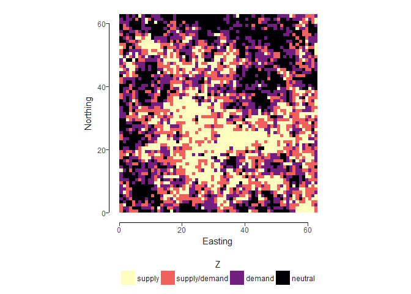
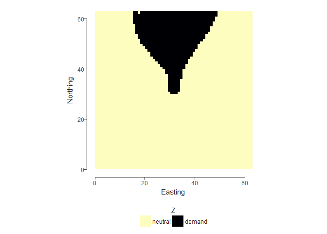
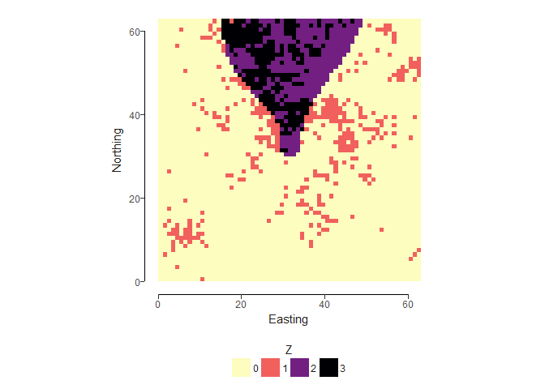

# Example Landscapes
Laura Graham  
18 December 2017  


Generating a landscape with random land covers along an edge gradient. 


```r
# Random Landscape
l1 <- nlm_random(nrow, ncol)
util_plot(l1)
```

```
## Coordinate system already present. Adding new coordinate system, which will replace the existing one.
```

<!-- -->

```r
# Edge gradient
l2 <- nlm_edgegradient(nrow, ncol)
util_plot(l2)
```

```
## Coordinate system already present. Adding new coordinate system, which will replace the existing one.
```

<!-- -->

```r
# Random landscape with a gradient
l3 <- util_merge(l1, l2)
util_plot(l3)
```

```
## Coordinate system already present. Adding new coordinate system, which will replace the existing one.
```

<!-- -->

Generating landscapes with fixed proportions of supply, demand, supply/demand, neutral, at different levels of fragmentation. 


```r
# roughness = 0 --> most clumped (full spatial autocorrelation)
mpd_0 <- nlm_mpd(nrow, ncol, roughness=0)
```

```
## nlm_mpd returns RasterLayer with that fits in the dimension 2^n+1
```

```r
mpd_class_0 <- util_classify(mpd_0, weighting=c(0.25, 0.25, 0.25, 0.25), level_names=c("supply", "supply/demand", "demand", "neutral"))
util_plot(mpd_class_0, discrete = TRUE)
```

```
## Coordinate system already present. Adding new coordinate system, which will replace the existing one.
```

<!-- -->

```r
# roughness = 0.5 --> intermediate level of fragmentation (intermediate spatial autocorrelation)
mpd_0.5 <- nlm_mpd(nrow, ncol, roughness=0.5)
```

```
## nlm_mpd returns RasterLayer with that fits in the dimension 2^n+1
```

```r
mpd_class_0.5 <- util_classify(mpd_0.5, weighting=c(0.25, 0.25, 0.25, 0.25), level_names=c("supply", "supply/demand", "demand", "neutral"))
util_plot(mpd_class_0.5, discrete = TRUE)
```

```
## Coordinate system already present. Adding new coordinate system, which will replace the existing one.
```

<!-- -->

```r
# roughness = 0.75 --> higher level of fragmentation (lower spatial autocorrelation)
mpd_0.75 <- nlm_mpd(nrow, ncol, roughness=0.75)
```

```
## nlm_mpd returns RasterLayer with that fits in the dimension 2^n+1
```

```r
mpd_class_0.75 <- util_classify(mpd_0.75, weighting=c(0.25, 0.25, 0.25, 0.25), level_names=c("supply", "supply/demand", "demand", "neutral"))
util_plot(mpd_class_0.75, discrete = TRUE)
```

```
## Coordinate system already present. Adding new coordinate system, which will replace the existing one.
```

<!-- -->

```r
# roughness = 1 --> highest level of fragmentation (complete spatial autocorrelation)
mpd_1 <- nlm_mpd(nrow, ncol, roughness=1)
```

```
## nlm_mpd returns RasterLayer with that fits in the dimension 2^n+1
```

```r
mpd_class_1 <- util_classify(mpd_1, weighting=c(0.25, 0.25, 0.25, 0.25), level_names=c("supply", "supply/demand", "demand", "neutral"))
util_plot(mpd_class_1, discrete = TRUE)
```

```
## Coordinate system already present. Adding new coordinate system, which will replace the existing one.
```

<!-- -->

The issue with this is that the fragmentation, and location, of patches is related for each of the land cover types. We can get around this by creating two landscapes - one supply, one demand, then merging to get a landscape which has different levels of fragmentation depending on supply or demand. See below an example where there is 15% cover of both supply and demand (note this will not necessarily total 30% of the landscape because of the supply/demand overlap). There is 


```r
# supply and demand continuous surfaces
supply <- nlm_mpd(nrow, ncol, roughness = 1)
```

```
## nlm_mpd returns RasterLayer with that fits in the dimension 2^n+1
```

```r
demand <- nlm_mpd(nrow, ncol, roughness = 0)
```

```
## nlm_mpd returns RasterLayer with that fits in the dimension 2^n+1
```

```r
# discretise them based on 15% cover for each
supply_bin <- util_classify(supply, weighting = c(0.85, 0.15), level_names = c("neutral", "supply"))
util_plot(supply_bin, discrete = TRUE)
```

```
## Coordinate system already present. Adding new coordinate system, which will replace the existing one.
```

<!-- -->

```r
demand_bin <- util_classify(demand, weighting = c(0.85, 0.15), level_names = c("neutral", "demand"))
util_plot(demand_bin, discrete = TRUE)
```

```
## Coordinate system already present. Adding new coordinate system, which will replace the existing one.
```

<!-- -->

```r
# the below gives us a value of 0 for neutral and 2 for demand (supply remains at 1) which allows us to add then surfaces together. 
demand_bin <- demand_bin*2

# add the surfaces to get the supply, demand, supply/demand, neutral surfaces
sd <- supply_bin + demand_bin
util_plot(sd, discrete = TRUE)
```

```
## Coordinate system already present. Adding new coordinate system, which will replace the existing one.
```

<!-- -->

For the final landscape created, we can then convert it into a network. First by converting to polygons, then by using the distances to create a matrix. We have two decisions to make here:

1. How are the patches defined? In the below we use the four-neighbour rule, but there are many ways to do this, which are likely service specific. 

2. How are distances defined? Here, I have two rules
  a. **Euclidean distances**: every pair is linked with a weight based on Euclidean distance
  b. **Binary**: a pair of nodes is considered linked if they are < 15 cells apart (no weight)
  

```r
# polygonise the raster and plot
nodes <- rasterToPolygons(sd, dissolve=TRUE)
```

```
## Loading required namespace: rgeos
```

```r
nodes <- disaggregate(nodes)
nodes <- st_as_sf(nodes)
plot(nodes)
```

```
## Warning in classInt::classIntervals(values, nbreaks, breaks): n greater
## than number of different finite values\nn reset to number of different
## finite values
```

```
## Warning in classInt::classIntervals(values, nbreaks, breaks): n same
## as number of different finite values\neach different finite value is a
## separate class
```

<!-- -->

```r
# TODO: need to write code to visualise as a network (igraph/ggraph packages for this)

# create the network matrices
# 1. Euclidean distances
```

