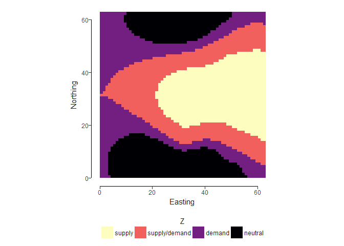
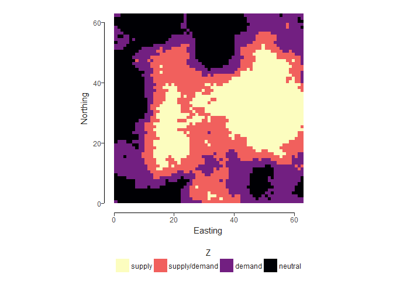
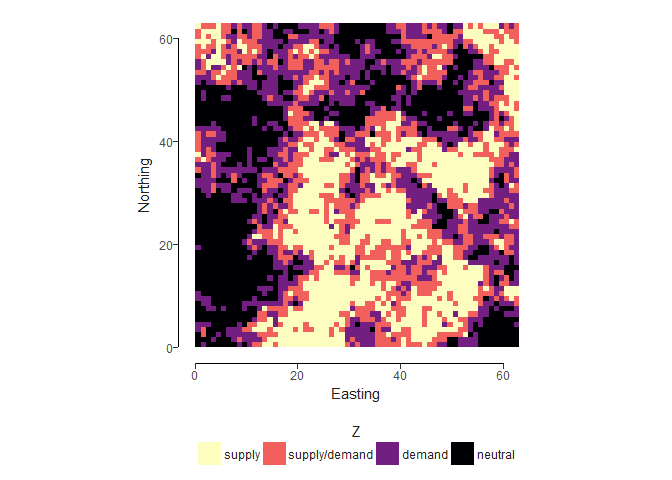
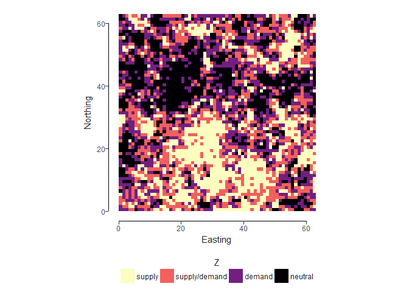
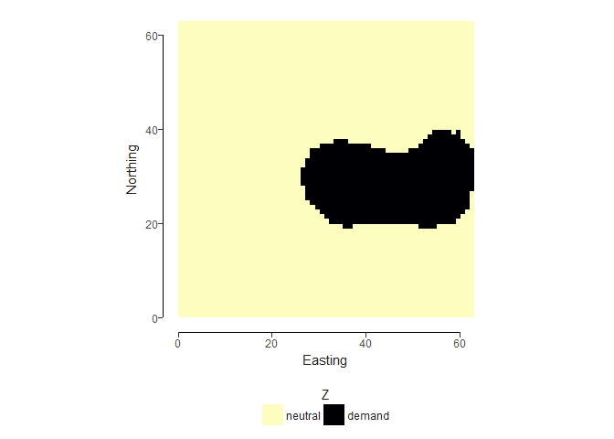
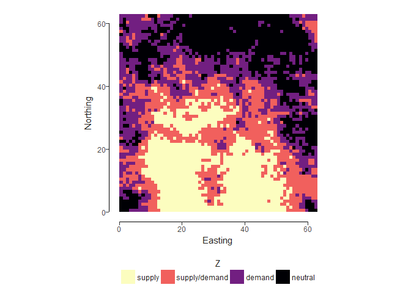
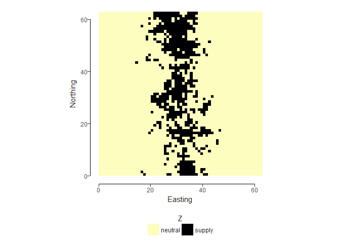

# Example Landscapes
Laura Graham  
18 December 2017  


## Things to think about

### Landscape simulation

Below I have outlined a few methods of simulating landscapes. My preference for starting off is one of the following: 

- Very simple: just simulate supply and demand at varying proportions and spatial autocorrelations using the first method (mid-point displacement plus binary classification). 

- Simple but more realistic: simulate supply/neutral and demand/neutral separately using the mid-point displacement and binary classification method, and then combine the layers. This allows us to control the proportion and level of fragmentation in each separately. The resulting landscape contains 4 cover types: neutral, supply, demand and supply/demand. A complication with this is that there are more dimensions to control, which brings in some difficulties with visualisation (see below). 

### Node definition
We can draw from the literature on patch definition for this (will update sources when I have time). I have used a 4-neighbour method for defining patches; this means that a patch is a group of cells which have at least one edge in common. We could define patches using the 8-neighbour method (the same, but also including diagonally adjacent cells); we could include any cells within *x* distance in a node. 

### Link definition
In this example, we have included two kinds of link definitions: (1) Euclidean distances: here every pairwise distance has been calculated and the link weight is the Euclidean distance; (2) binary links: any link with a weight less than a specified value is considered a link. There are other ways we could define these distances, such us cost-distance or functional distances. 

### How to visualise multiple dimensions
The idea with these landscapes is to use the derived equations (from one of the other tasks) to then calculate ecosystem service benefit. In order to investigate the effect of landscape pattern, we need to effectively visualise this, but with many parameters to change, this could become quite complicated. Then we need to do this for 6 services. At the moment I see that we have 4 parameters to vary (if we use the second method of landscape simulation stipulated above): supply proportion, demand proportion, supply fragmentation, demand fragmentation. We need to think about how we can visualise the results along each of these axes. 

## Simple landscape generation

One of the simplest methods to generate landscapes with fixed proportions of supply, demand, supply/demand, neutral, at different levels of fragmentation is to use mid-point displacement method for generating continuous surfaces of differing spatial autocorrelation and then to classify into discrete categories.


```r
# roughness = 0 --> most clumped (full spatial autocorrelation)
mpd_0 <- nlm_mpd(nrow, ncol, roughness=0)
```

```
## nlm_mpd returns RasterLayer with that fits in the dimension 2^n+1
```

```r
mpd_class_0 <- util_classify(mpd_0, weighting=c(0.25, 0.25, 0.25, 0.25), level_names=c("supply", "supply/demand", "demand", "neutral"))
util_plot(mpd_class_0, discrete = TRUE)
```

```
## Coordinate system already present. Adding new coordinate system, which will replace the existing one.
```

<!-- -->

```r
# roughness = 0.5 --> intermediate level of fragmentation (intermediate spatial autocorrelation)
mpd_0.5 <- nlm_mpd(nrow, ncol, roughness=0.5)
```

```
## nlm_mpd returns RasterLayer with that fits in the dimension 2^n+1
```

```r
mpd_class_0.5 <- util_classify(mpd_0.5, weighting=c(0.25, 0.25, 0.25, 0.25), level_names=c("supply", "supply/demand", "demand", "neutral"))
util_plot(mpd_class_0.5, discrete = TRUE)
```

```
## Coordinate system already present. Adding new coordinate system, which will replace the existing one.
```

<!-- -->

```r
# roughness = 0.75 --> higher level of fragmentation (lower spatial autocorrelation)
mpd_0.75 <- nlm_mpd(nrow, ncol, roughness=0.75)
```

```
## nlm_mpd returns RasterLayer with that fits in the dimension 2^n+1
```

```r
mpd_class_0.75 <- util_classify(mpd_0.75, weighting=c(0.25, 0.25, 0.25, 0.25), level_names=c("supply", "supply/demand", "demand", "neutral"))
util_plot(mpd_class_0.75, discrete = TRUE)
```

```
## Coordinate system already present. Adding new coordinate system, which will replace the existing one.
```

<!-- -->

```r
# roughness = 1 --> highest level of fragmentation (complete spatial autocorrelation)
mpd_1 <- nlm_mpd(nrow, ncol, roughness=1)
```

```
## nlm_mpd returns RasterLayer with that fits in the dimension 2^n+1
```

```r
mpd_class_1 <- util_classify(mpd_1, weighting=c(0.25, 0.25, 0.25, 0.25), level_names=c("supply", "supply/demand", "demand", "neutral"))
util_plot(mpd_class_1, discrete = TRUE)
```

```
## Coordinate system already present. Adding new coordinate system, which will replace the existing one.
```

<!-- -->

The issue with this is that the fragmentation, and location, of patches is related for each of the land cover types. This is fine for services where we want the same level of fragmentation in supply and demand. Also, it makes most sense when we only map supply and demand: once we have more categories (e.g. the supply/demand and neutral), the order in which we specify the category then becomes important, making it more complicated. 

We can get around this by creating two landscapes - one supply, one demand, then merging to get a landscape which has different levels of fragmentation depending on supply or demand. See below an example where there is 15% cover of both supply and demand (note this will not necessarily total 30% of the landscape because of the supply/demand overlap). 


```r
# supply and demand continuous surfaces
supply <- nlm_mpd(nrow, ncol, roughness = 1)
```

```
## nlm_mpd returns RasterLayer with that fits in the dimension 2^n+1
```

```r
demand <- nlm_mpd(nrow, ncol, roughness = 0)
```

```
## nlm_mpd returns RasterLayer with that fits in the dimension 2^n+1
```

```r
# discretise them based on 15% cover for each
supply_bin <- util_classify(supply, weighting = c(0.85, 0.15), level_names = c("neutral", "supply"))
util_plot(supply_bin, discrete = TRUE)
```

```
## Coordinate system already present. Adding new coordinate system, which will replace the existing one.
```

<!-- -->

```r
demand_bin <- util_classify(demand, weighting = c(0.85, 0.15), level_names = c("neutral", "demand"))
util_plot(demand_bin, discrete = TRUE)
```

```
## Coordinate system already present. Adding new coordinate system, which will replace the existing one.
```

<!-- -->

```r
# the below gives us a value of 0 for neutral and 2 for demand (supply remains at 1) which allows us to add then surfaces together. 
demand_bin <- demand_bin*2

# add the surfaces to get the supply, demand, supply/demand, neutral surfaces
sd <- supply_bin + demand_bin
util_plot(sd, discrete = TRUE)
```

```
## Coordinate system already present. Adding new coordinate system, which will replace the existing one.
```

<!-- -->

## From landscape to network

For the final landscape created, we can then convert it into a network. First by converting to polygons, then by using the distances to create a matrix. We have two decisions to make here:

1. How are the patches defined? In the below we use the four-neighbour rule, but there are many ways to do this, which are likely service specific. 

2. How are distances defined? Here, I have two rules
  a. *Euclidean distances*: every pair is linked with a weight based on Euclidean distance
  b. *Binary*: a pair of nodes is considered linked if they are < 15 cells apart (no weight)
  

```r
# polygonise the raster and plot
nodes <- rasterToPolygons(sd, dissolve=TRUE)
```

```
## Loading required namespace: rgeos
```

```r
nodes <- disaggregate(nodes)
nodes <- st_as_sf(nodes)
plot(nodes)
```

```
## Warning in classInt::classIntervals(values, nbreaks, breaks): n greater
## than number of different finite values\nn reset to number of different
## finite values
```

```
## Warning in classInt::classIntervals(values, nbreaks, breaks): n same
## as number of different finite values\neach different finite value is a
## separate class
```

<!-- -->

```r
# get cover type (supply, demand, supply/demand, neutral)
nodes$type <- factor(nodes$layer, labels=c("neutral", "supply", "demand", "supply/demand"))

# get area information
nodes$area <- st_area(nodes)

# create the network matrices
# 1. Euclidean distances
nodes_euclid <- st_distance(nodes)

# 2. Binary distances (threshold of 15 units)
nodes_binary <- ifelse(nodes_euclid > 15, 0, 1)

# TODO: need to write code to visualise both as a network (igraph/ggraph packages for this)
```

## More complex landscape generation

Merging a spatially autocorrelated landscape with an edge gradient. For this we will create a supply landscape that has an edge gradient by merging our landscape from above with one with an edge gradient.


```r
# Edge gradient
edge <- nlm_edgegradient(nrow(supply), ncol(supply))
util_plot(edge)
```

```
## Coordinate system already present. Adding new coordinate system, which will replace the existing one.
```

<!-- -->

```r
# Random landscape with a gradient
supply_edge <- util_merge(supply, edge)
supply_edge_bin <- util_classify(supply_edge, weighting = c(0.85, 0.15), level_names = c("neutral", "supply"))
util_plot(supply_edge_bin, discrete = TRUE)
```

```
## Coordinate system already present. Adding new coordinate system, which will replace the existing one.
```

<!-- -->

## Other landscapes
The [NLMR package](https://marcosci.github.io/NLMR/) has [16 methods](https://marcosci.github.io/NLMR/articles/bestiary.html) for creating neutral landscape models, these can then be merged and/or classified. 
