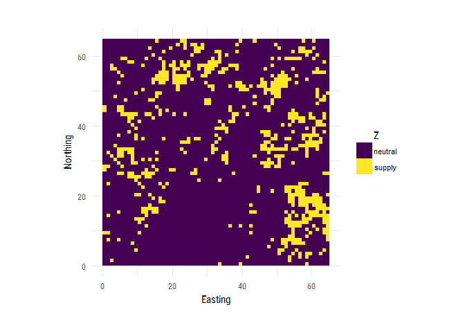
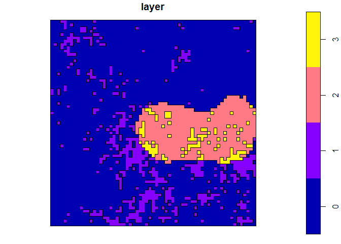
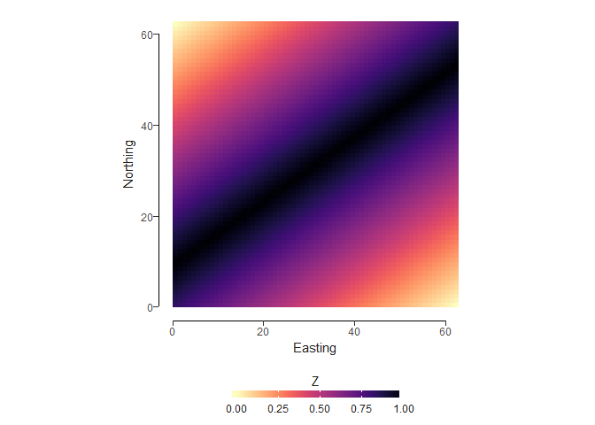
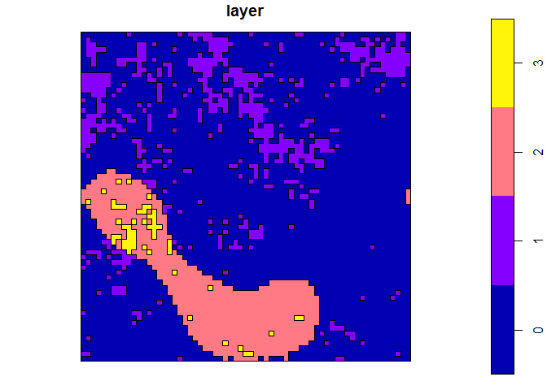
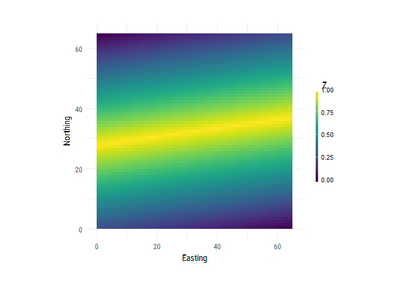
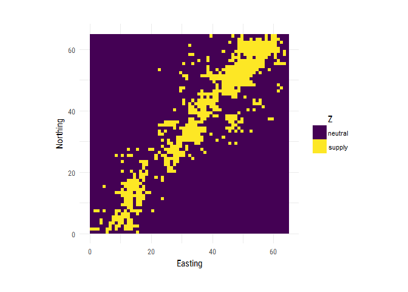

# Landscape Simulation: Initial thoughts
Laura Graham  
18 December 2017  

In this document I've put together some things we need to think about to make sure we set up the landscape simulations sensibly and then shown some examples of landscapes, and how we go from this to a network. 

## Things to think about

### Landscape simulation

Below I have outlined a reasonably simple but fairly realistic method to simulate a the landscapes: simulate supply/neutral and demand/neutral separately using the mid-point displacement and binary classification method, and then combine the layers. This allows us to control the proportion and level of fragmentation in each separately. The resulting landscape contains 4 cover types: neutral, supply, demand and supply/demand. A complication with this is that there are more dimensions to control, which brings in some difficulties with visualisation (see below). 

The 'supply/demand' class is not realistic in this case, general suggestion is that we drop this and reclassify the overlap of supply and demand with the dominant surrounding class. Additional suggestion of supply, demand and natural land cover classes. 

*An additional point to think about, mentioned by Jonathan, is that we might also want to control the level of interspersion: the level of fragmentation between social and ecological nodes. Need to work out a way of doing this, but it seems entirely possible.*

### Patch (node) definition
We can draw from the literature on patch definition for this. We could use the 4-neighbour method for defining patches; this means that a patch is a group of cells which have at least one edge in common; the 8-neighbour method (the same, but also including diagonally adjacent cells); or we could include any cells within *x* distance in a node. Overall consensus is 8-neighbour patch definition for now. 

### Link definition
In this example, we have included two kinds of link definitions: (1) Euclidean distances: here every pairwise distance has been calculated and the link weight is the closest edge-to-edge Euclidean distance; (2) binary links: any link with a weight less than a specified value is considered a link. There are other ways we could define these distances, such us cost-distance or functional distances. Euclidean distances makes the most sense to start off with, but it might be useful to have input from Örjan on which best facilitate the analysis of networks (I seem to remember the examples he showed having binary links). More complicated measures (least cost and functional distances) can be explored at later stages. The differences between the service typologies will come into the links (see explanation below).

### How to visualise multiple dimensions
*This is something to keep at the back of our minds while designing experimental set-up*
The idea with these landscapes is to use the derived equations (from one of the other tasks) to then calculate ecosystem service benefit. In order to investigate the effect of landscape pattern, we need to effectively visualise this, but with many parameters to change, this could become quite complicated. Then we need to do this for 6 services. At the moment I see that we have 4 parameters to vary (if we use the second method of landscape simulation stipulated above): supply proportion, demand proportion, supply fragmentation, demand fragmentation. We need to think about how we can visualise the results along each of these axes. Note: AC to ask colleagues who are currently researching ES trade-off visualisation.

## Ecosystem service typologies for landscape simulation

For the paper, we've defined typologies of ES which are relevent to landscape structure. Below I've outlined how we can convert these to neutral landscapes. I think it's likely that the global links and local links typologies will not need analysing as a network. Within the remaining three, there are no differences between the simulated landscapes, it will be in the way the links are defined that the differences are manifest. 

### Proximity-independent/global links

**Examples**: Carbon sequestration, existence value, aesthetic appreciation & spiritual, regulation of ocean acidification

**Simulated landscape**: supply only; vary area and fragmentation - this does not necessarily need a network approach

### Proximity dependent - biophysical movement

**Examples of uni-directional**: Erosion prevention, regulation of extreme events, drinking water, waste water treatment

**Simulated landscapes**: supply and demand; vary fragmentation of each, interspersion, area and intensity; incorporate directionality into the definition of links; links will be one way (supply to demand)

**Examples of omni-directional**: Local climate and air regulation, pollination, biocontrol

**Simulated landscapes**: supply and demand; vary fragmentation of each, interspersion, area and intensity; links will be one way (supply to demand)

### Proximity dependent - user movement

**Examples of omni-directional**: Recreation, mental health, tourism, timber, medicinal resources, food, raw materials

**Simulated landscapes**: supply and demand; vary fragmentation of each, interspersion, area and intensity; links will be one way (demand to supply)

### Very proximity-dependent/local links

**Examples**: Soil fertility/formation, habitat creation, food production, non-timber forest products, recreational

**Simulated landscapes**: one category - supply/demand; variation will be in the area and quality of patches - this does not necessarily need a network approach

## Simple landscape generation

We can control supply and demand seperately by creating two landscapes - one supply, one demand, then merging to get a landscape which has different levels of fragmentation for supply and demand. See below an example where there is 15% cover of both supply and demand. Note that at present, when supply and demand overlap, this becomes the supply/demand category. We have discussed changing this so that rather than having a supply/demand overlap, there are rules (such as dominant surrounding cover) which determine whether a cell is supply or demand. 

### 15% supply, highest level of fragmentation (roughness = 1)
<!-- -->

### 15% demand, no fragmentation (roughness = 0)
<!-- -->

### The combined landscape gives us values for neutral (0), supply (1), demand(2) and supply/demand (3)
<!-- -->

## From landscape to network

For the final landscape created, we can then convert it into a network. First by converting to polygons, then by using the distances to create a matrix. We have two decisions to make here:

1. How are the patches defined? In the below we use the four-neighbour rule, but there are many ways to do this, which are likely service specific. 

2. How are distances defined? Here, I have two rules
  a. *Euclidean distances*: every pair is linked with a weight based on Euclidean distance
  b. *Binary*: a pair of nodes is considered linked if they are < 15 cells apart (no weight)
  
<!-- -->

## More complex landscape generation
*We can leave this for now - to come back to later*

Merging a spatially autocorrelated landscape with an edge gradient. For this we will create a supply landscape that has an edge gradient by merging our landscape from above with one with an edge gradient.

<!-- --><!-- -->

## Other landscapes
The [NLMR package](https://marcosci.github.io/NLMR/) has [16 methods](https://marcosci.github.io/NLMR/articles/bestiary.html) for creating neutral landscape models, these can then be merged and/or classified. 
