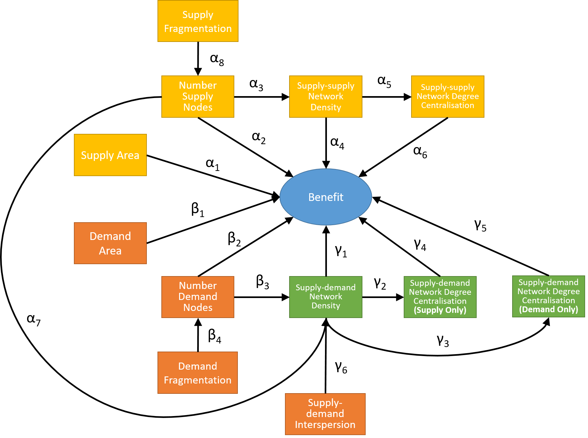

```{r setup, include = FALSE}
knitr::opts_chunk$set(echo = FALSE)
library(tidyverse)
library(broom)
library(knitr)
library(jtools)
library(psych)
library(lavaan)
```

## Introduction

In this document, we analyse the results of the simulations generated using `es_benefit.R`.

## Data set-up

### Compile simulation results

```{r compile_data, echo = TRUE, eval = FALSE}
#set eval = FALSE if results already compiled
f = list.files("results/benefit_replicates", full.names = TRUE)

read_rda = function(x) {
	load(x)
	return(out)
}

out = map_dfr(f, read_rda)

save(out, file = "results/all_replicates.rda")
```

### Load simulation results

```{r load_data, echo = TRUE, eval = TRUE}
#set eval = TRUE if results not compiled above
load("results/all_replicates.rda")
```

### Manipulate simulation data

```{r manipulate_data, echo = TRUE, eval = TRUE}
res <- out %>%
mutate(ee_thresh = as.factor(ee_thresh),
			 es_thresh = as.factor(es_thresh),																
			 patch_size_effect = relevel(as.factor(alpha), ref = "1"),
			 ee_connectivity_effect = as.factor(beta),			 
			 rivalness = relevel(as.factor(rival), ref = "FALSE"),
			 substitutability = as.factor(gamma),
			 size_supply = p_supply / num_supply,
			 size_demand = p_demand / num_demand) %>%
select(benefit, supply, p_supply, p_demand, f_supply, f_demand, num_supply, num_demand, size_supply, size_demand, ee_density, es_density, ee_centr_degree, es_centr_degree, ee_thresh, es_thresh, patch_size_effect, ee_connectivity_effect, rivalness, substitutability)

#tidy up memory
rm(out)
invisible(gc(verbose = FALSE))

#group simulations by the factors
group_res <- res %>%
  group_by(ee_thresh, es_thresh, patch_size_effect, ee_connectivity_effect, rivalness, substitutability) %>%
  nest()

#tidy up memory
rm(res)
invisible(gc(verbose = FALSE))
```

## Model fitting

Here we first develop path models based on the conceptualisation of the relationships between the amount of supply and demand and network metrics represented in the figure below.

```{r, echo = FALSE, eval = TRUE}

```

Then we develop a linear model to explain the total effects (direct and indirect) of each variable in the figure above as a function of: (1) the spatial scale of supply-supply links, (2) the spatial scale of the supply-demand links,(3) whether the effect of patch size on supply is linear, or follows a species-area relationship (SAR), (4) the size and direction of the effect of supply-supply links, (5) whether the ecosystem service is rival or non-rival, and (6) the degree of non-substitutability of the ecosystem service.       

### Define function to fit the path models

```{r fit_model, echo = TRUE, eval = TRUE}
fit_sem <- function(dat, model) {
	sem(model, data = dat)
}
````

### Define path model structure

```{r path_model, echo = TRUE, eval = TRUE}
#change here to change model structure
path_mod <- '
						#regressions
						benefit ~  alpha1 * p_supply + alpha2 * p_demand +  + alpha3 * p_demand:p_supply + beta1 * num_supply + beta2 * ee_density + beta3 * ee_centr_degree + beta4 * num_demand + beta5 * es_density + beta6 * es_centr_degree
						num_supply ~ gamma8 * f_supply
						ee_density ~ gamma10 * p_supply + gamma9 * f_supply + eta1 * num_supply
						ee_centr_degree ~ eta2 * ee_density
						num_demand ~ gamma5 * f_demand
						es_density ~ gamma1 * p_supply + gamma2 * p_demand + gamma3 * p_demand:p_supply + gamma7 * f_supply + gamma4 * f_demand  + gamma6 * f_demand:f_supply + eta3 * num_supply + eta4 * num_demand + eta5 * num_supply:num_demand    
						es_centr_degree ~ eta6 * es_density

						#calculate total effects
						total_sscen := beta3
						total_sdcen := beta6
						total_ssden := beta2 + eta2 * total_sscen
						total_sdden := beta5 + eta5 * total_sdcen
						total_ns := beta1 + eta1 * total_ssden + eta3 * total_sdden
						total_nd := beta4 + eta4 * total_sdden
						total_nsnd := eta5 * total_sdden
						total_fs := gamma8 * total_ns + gamma9 * total_ssden + gamma7 * total_sdden
						total_fd := gamma5 * total_nd + gamma4 * total_sdden
						total_fsd := gamma6 * total_sdden
						total_ps := alpha1 + gamma8 * total_ssden + gamma1 * total_sdden
						total_pd := alpha2 + gamma2 * total_sdden
						total_psd := alpha3 + gamma3 * total_sdden
'
```

### Define function to return total effects of each variable

```{r estimates, echo = TRUE, eval = TRUE}
#change here for different model structures
get_estimates <- function(model) {
	as_tibble(filter(parameterEstimates(model),label=="total_s" | label=="total_d" | label=="total_sd" | label=="total_ns" | label=="total_nd"
	   				| label=="total_nsnd" | label=="total_ssden" | label=="total_sdden" | label=="total_sscen" | label=="total_sdcen")) %>%
						select(label, est, se, ci.lower, ci.upper)
}
````

### Define function to fit linear model to explain effects in the path models

```{r linear_model, echo = TRUE, eval = TRUE}
#change here for different model structures
fit_lm <- function(data) {
	lm(est ~ ee_thresh + es_thresh + patch_size_effect + ee_connectivity_effect + rivalness + substitutability, data = data)
}
```

### Run the analysis

```{r run_analysis, echo = TRUE, eval = TRUE, warning = FALSE}
#check for collinearity
cor(select(group_res$data[[1]],c(num_supply, num_demand, p_supply, p_demand, ee_density, ee_centr_degree, es_density,  es_centr_degree)),				use="complete.obs", method=c("spear"))

#fit the path models
path_models <-	group_res %>%	mutate(data_scaled = map(data, scale),
	         mod = map(.x = data_scaled, .f = fit_sem, model = path_mod),
					 effects = map(mod, get_estimates))

#re-arrange data
path_data <- path_models %>% select(-data, -data_scaled, -mod) %>% unnest() %>% group_by(label) %>%
									mutate(ee_thresh = scale(as.numeric(as.character(ee_thresh))), es_thresh = scale(as.numeric(as.character(es_thresh))),
									ee_connectivity_effect = scale(as.numeric(as.character(ee_connectivity_effect))),
									substitutability = scale(-as.numeric(as.character(substitutability)))) %>% nest()
									# multiply substitutability by -1 so it is a measure of substitutability not non-substitutability

#fit linear models to explain path coefficients
linear_models <- path_data %>% mutate(lm_est = map(.x = data, .f = fit_lm)) %>% mutate(coefs = map(.x = lm_est, .f = coef))					 
```

## Plot results

In all the plots below, the baseline service is one where: (1) the scale of supply and demand links is around half the landscape size, (2) patch size effects on supply follow a species area relationship, (3) supply-supply connectivity effect is zero, (4) the service is non-rival, and (5) the service is moderately substitutable. The effect of deviations from this baseline are shown.    

### Effect of amount of supply on benefit

In the figure below, the baseline effect of the amount of supply on benefit is positive (intercept) and this effect becomes more positive with: (1) linear versus SAR patch size effects, (2) the effect of supply-supply connections becoming more positive, and (3) rival versus non rival.      

```{r effect_supply, echo = FALSE, eval = TRUE, warning = FALSE}
Xlabels <- factor(c("Intercept", "SS link scale", "SD link scale", "Linear vs SAR patch size effect", "SS connectivity effect", "Rival vs non-rival", "Non-substitutability"), levels = c("Intercept", "SS link scale", "SD link scale", "Linear vs SAR patch size effect", "SS connectivity effect", "Rival vs non-rival", "Non-substitutability"))

ggplot(data = as_tibble(linear_models$coefs[[1]]), aes(x = Xlabels, y = value)) + geom_bar(stat = "identity", width = 0.5) + theme(axis.text.x = element_text(angle = 90, hjust = 1, vjust = 0.5)) + ggtitle("Effect of 'Amount of Supply' on Benefit") + theme(plot.title = element_text(hjust = 0.5)) + xlab("Baseline and effect of deviations from baseline") + ylab("Effect size") + ylim(-0.3, 0.3)
```

### Effect of amount of demand on benefit

In the figure below, the baseline effect of the amount of demand on benefit is positive (intercept) and this effect becomes more positive with: (1) linear versus SAR patch size effects, and (2) increased non-substitutability, and this effect becomes less positive with: (1) increased non-substitutability.      

```{r effect_demand, echo = FALSE, eval = TRUE, warning = FALSE}
Xlabels <- factor(c("Intercept", "SS link scale", "SD link scale", "Linear vs SAR patch size effect", "SS connectivity effect", "Rival vs non-rival", "Non-substitutability"), levels = c("Intercept", "SS link scale", "SD link scale", "Linear vs SAR patch size effect", "SS connectivity effect", "Rival vs non-rival", "Non-substitutability"))

ggplot(data = as_tibble(linear_models$coefs[[2]]), aes(x = Xlabels, y = value)) + geom_bar(stat = "identity", width = 0.5) + theme(axis.text.x = element_text(angle = 90, hjust = 1, vjust = 0.5)) + ggtitle("Effect of 'Amount of Demand' on Benefit") + theme(plot.title = element_text(hjust = 0.5)) + xlab("Baseline and effect of deviations from baseline") + ylab("Effect size") + ylim(-0.3, 0.3)
```

### Effect of amount of supply x amount of demand on benefit

In the figure below, the baseline effect of the amount of supply x amount of demand (i.e., interaction) on benefit is positive (intercept) and this effect becomes more positive with: (1) linear versus SAR patch size effects, and (2) the effect of supply-supply connections becoming more positive, and this effect becomes less positive with: (1) rival versus non-rival.      

```{r effect_supply_demand, echo = FALSE, eval = TRUE, warning = FALSE}
Xlabels <- factor(c("Intercept", "SS link scale", "SD link scale", "Linear vs SAR patch size effect", "SS connectivity effect", "Rival vs non-rival", "Non-substitutability"), levels = c("Intercept", "SS link scale", "SD link scale", "Linear vs SAR patch size effect", "SS connectivity effect", "Rival vs non-rival", "Non-substitutability"))

ggplot(data = as_tibble(linear_models$coefs[[3]]), aes(x = Xlabels, y = value)) + geom_bar(stat = "identity", width = 0.5) + theme(axis.text.x = element_text(angle = 90, hjust = 1, vjust = 0.5)) + ggtitle("Effect of 'Amount of Supply x Demand' on Benefit") + theme(plot.title = element_text(hjust = 0.5)) + xlab("Baseline and effect of deviations from baseline") + ylab("Effect size")  + ylim(-0.3, 0.3)
```

### Effect of number of supply patches on benefit

In the figure below, the baseline effect of the number of supply patches on benefit is positive (intercept) and this effect becomes less positive with: (1) linear versus SAR patch size effects.      

```{r effect_num_supply, echo = FALSE, eval = TRUE, warning = FALSE}
Xlabels <- factor(c("Intercept", "SS link scale", "SD link scale", "Linear vs SAR patch size effect", "SS connectivity effect", "Rival vs non-rival", "Non-substitutability"), levels = c("Intercept", "SS link scale", "SD link scale", "Linear vs SAR patch size effect", "SS connectivity effect", "Rival vs non-rival", "Non-substitutability"))

ggplot(data = as_tibble(linear_models$coefs[[4]]), aes(x = Xlabels, y = value)) + geom_bar(stat = "identity", width = 0.5) + theme(axis.text.x = element_text(angle = 90, hjust = 1, vjust = 0.5)) + ggtitle("Effect of 'Number of Supply Patches' on Benefit") + theme(plot.title = element_text(hjust = 0.5)) + xlab("Baseline and effect of deviations from baseline") + ylab("Effect size") + ylim(-0.3, 0.3)
```

### Effect of number of demand patches on benefit

In the figure below, the effect of the number of demand patches on benefit is small but, the baseline effect of the number of demand patches on benefit is negative (intercept) and this effect becomes less negative with: (1) rival versus non-rival.      

```{r effect_num_demand, echo = FALSE, eval = TRUE, warning = FALSE}
Xlabels <- factor(c("Intercept", "SS link scale", "SD link scale", "Linear vs SAR patch size effect", "SS connectivity effect", "Rival vs non-rival", "Non-substitutability"), levels = c("Intercept", "SS link scale", "SD link scale", "Linear vs SAR patch size effect", "SS connectivity effect", "Rival vs non-rival", "Non-substitutability"))

ggplot(data = as_tibble(linear_models$coefs[[5]]), aes(x = Xlabels, y = value)) + geom_bar(stat = "identity", width = 0.5) + theme(axis.text.x = element_text(angle = 90, hjust = 1, vjust = 0.5)) + ggtitle("Effect of 'Number of Demand Patches' on Benefit") + theme(plot.title = element_text(hjust = 0.5)) + xlab("Baseline and effect of deviations from baseline") + ylab("Effect size") + ylim(-0.3, 0.3)
```

### Effect of number of supply patches x number of demand patches on benefit

In the figure below, the effect of the number of supply patches x the number of demand patches on benefit is very small.   

```{r effect_num_supply_demand, echo = FALSE, eval = TRUE, warning = FALSE}
Xlabels <- factor(c("Intercept", "SS link scale", "SD link scale", "Linear vs SAR patch size effect", "SS connectivity effect", "Rival vs non-rival", "Non-substitutability"), levels = c("Intercept", "SS link scale", "SD link scale", "Linear vs SAR patch size effect", "SS connectivity effect", "Rival vs non-rival", "Non-substitutability"))

ggplot(data = as_tibble(linear_models$coefs[[6]]), aes(x = Xlabels, y = value)) + geom_bar(stat = "identity", width = 0.5) + theme(axis.text.x = element_text(angle = 90, hjust = 1, vjust = 0.5)) + ggtitle("Effect of 'Number of Supply Patches x Number of Demand Patches' on Benefit") + theme(plot.title = element_text(hjust = 0.5)) + xlab("Baseline and effect of deviations from baseline") + ylab("Effect size") + ylim(-0.3, 0.3)
```

### Effect of supply-supply network density on benefit

In the figure below, the effect of the supply-supply network density is small, but the baseline effect of the supply-supply network density is negative (intercept) and this effect becomes less negative with: (1) increasing scale of the supply-supply links, and (2) the effect of supply-supply connections becoming more positive.

```{r effect_ss_density, echo = FALSE, eval = TRUE, warning = FALSE}
Xlabels <- factor(c("Intercept", "SS link scale", "SD link scale", "Linear vs SAR patch size effect", "SS connectivity effect", "Rival vs non-rival", "Non-substitutability"), levels = c("Intercept", "SS link scale", "SD link scale", "Linear vs SAR patch size effect", "SS connectivity effect", "Rival vs non-rival", "Non-substitutability"))

ggplot(data = as_tibble(linear_models$coefs[[7]]), aes(x = Xlabels, y = value)) + geom_bar(stat = "identity", width = 0.5) + theme(axis.text.x = element_text(angle = 90, hjust = 1, vjust = 0.5)) + ggtitle("Effect of 'Supply-Supply Network Density' on Benefit") + theme(plot.title = element_text(hjust = 0.5)) + xlab("Baseline and effect of deviations from baseline") + ylab("Effect size") + ylim(-0.3, 0.3)
```

### Effect of supply-demand network density on benefit

In the figure below, the effect of the supply-demand network density is very small.       

```{r effect_sd_density, echo = FALSE, eval = TRUE, warning = FALSE}
Xlabels <- factor(c("Intercept", "SS link scale", "SD link scale", "Linear vs SAR patch size effect", "SS connectivity effect", "Rival vs non-rival", "Non-substitutability"), levels = c("Intercept", "SS link scale", "SD link scale", "Linear vs SAR patch size effect", "SS connectivity effect", "Rival vs non-rival", "Non-substitutability"))

ggplot(data = as_tibble(linear_models$coefs[[8]]), aes(x = Xlabels, y = value)) + geom_bar(stat = "identity", width = 0.5) + theme(axis.text.x = element_text(angle = 90, hjust = 1, vjust = 0.5)) + ggtitle("Effect of 'Supply-Demand Network Density' on Benefit") + theme(plot.title = element_text(hjust = 0.5)) + xlab("Baseline and effect of deviations from baseline") + ylab("Effect size") + ylim(-0.3, 0.3)
```

### Effect of supply-supply network centralisation on benefit

In the figure below, the baseline effect of the supply-supply network centralisation is negative and this effect becomes less negative with: (1) the effect of supply-supply connections becoming more positive.

```{r effect_ss_cent, echo = FALSE, eval = TRUE, warning = FALSE}
Xlabels <- factor(c("Intercept", "SS link scale", "SD link scale", "Linear vs SAR patch size effect", "SS connectivity effect", "Rival vs non-rival", "Non-substitutability"), levels = c("Intercept", "SS link scale", "SD link scale", "Linear vs SAR patch size effect", "SS connectivity effect", "Rival vs non-rival", "Non-substitutability"))

ggplot(data = as_tibble(linear_models$coefs[[9]]), aes(x = Xlabels, y = value)) + geom_bar(stat = "identity", width = 0.5) + theme(axis.text.x = element_text(angle = 90, hjust = 1, vjust = 0.5)) + ggtitle("Effect of 'Supply-Supply Network Centralisation' on Benefit") + theme(plot.title = element_text(hjust = 0.5)) + xlab("Baseline and effect of deviations from baseline") + ylab("Effect size") + ylim(-0.3, 0.3)
```

### Effect of supply-demand network centralisation on benefit

In the figure below, the effect of the supply-demand network centalisation is small, but the baseline effect of the supply-demand network centralisation is negative (intercept) and this effect becomes less negative with: (1) linear versus SAR patch size effects, and more negative with: (1) increasing scale of the supply-supply links, (2) increasing scale of the supply-demand links, (3) the effect of supply-supply connections becoming more positive, and (4) rival versus non-rival.  

```{r effect_sd_cent, echo = FALSE, eval = TRUE, warning = FALSE}
Xlabels <- factor(c("Intercept", "SS link scale", "SD link scale", "Linear vs SAR patch size effect", "SS connectivity effect", "Rival vs non-rival", "Non-substitutability"), levels = c("Intercept", "SS link scale", "SD link scale", "Linear vs SAR patch size effect", "SS connectivity effect", "Rival vs non-rival", "Non-substitutability"))

ggplot(data = as_tibble(linear_models$coefs[[10]]), aes(x = Xlabels, y = value)) + geom_bar(stat = "identity", width = 0.5) + theme(axis.text.x = element_text(angle = 90, hjust = 1, vjust = 0.5)) + ggtitle("Effect of 'Supply-Demand Network Centralisation' on Benefit") + theme(plot.title = element_text(hjust = 0.5)) + xlab("Baseline and effect of deviations from baseline") + ylab("Effect size") + ylim(-0.3, 0.3)
```
