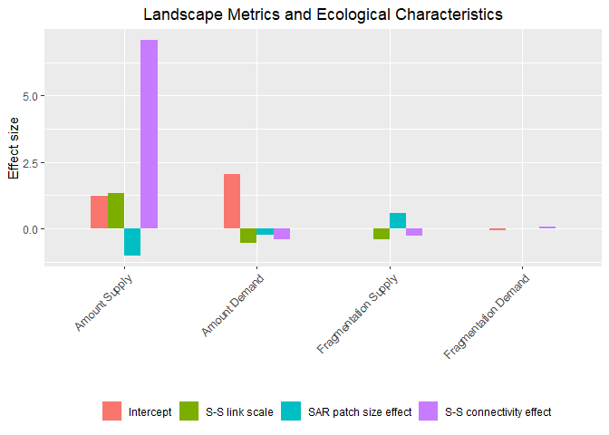
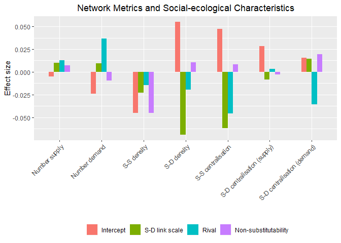

Simulation Analysis
================

## Introduction

In this document, we analyse the results of the simulations generated
using `es_benefit.R`.

## Data set-up

### Compile simulation results

``` r
#set eval = FALSE if results already compiled
f = list.files("results/benefit_replicates", full.names = TRUE)

#function to read simulation results and manipulate data
#this includes removing replicates with on only one supply or demand node (centrality not defined for these cases)
#and no connections between supply and demand nodes (ecosystem service benefit is always zero in these cases)
#and replicates where any of the centrality values are NA or NaN
#here we also standardise the continuous variables characterising the ecosystem services to be between 0 and 1
#(with beta centred on zero)  
read_rda = function(x) {
    load(x)
    res <- out %>%
                 mutate_at(.vars = c("ee_thresh", "es_thresh", "gamma"), .funs = function(x) (((x - min(x)) / (max(x) - min(x))))) %>%
                 mutate_at(.vars = c("beta"), .funs = function(x) (((x - min(x)) / (max(x) - min(x))) - 0.5)) %>%
                 filter((num_supply > 1) & (num_demand > 1) & !(es_density == 0) & !is.na(ee_centr_degree) & !is.na(es_centr_degree_supply) & !is.na(es_centr_degree_demand)) %>%
                 mutate(ee_thresh = as.factor(ee_thresh),
                 es_thresh = as.factor(es_thresh),                                                          
                 patch_size_effect = relevel(as.factor(alpha), ref = "1"),
                 ee_connectivity_effect = as.factor(beta),           
                 rivalness = relevel(as.factor(rival), ref = "FALSE"),
                 substitutability = as.factor(gamma)) %>%
                 select(benefit, p_supply, p_demand, f_supply, f_demand, num_supply, ee_density, ee_centr_degree, num_demand, es_density,
                 es_centr_degree_supply, es_centr_degree_demand, ee_thresh, es_thresh, patch_size_effect, ee_connectivity_effect,
                 rivalness, substitutability)
  rm(out)
    invisible(gc(verbose = FALSE))
    return(res)
}
out <- map_dfr(f[1:20], read_rda) #note: need to find solution to dealing with large file sizes - currently analysis only for 20 replicates
save(out, file = "results/all_replicates.rda")
```

### Load simulation results if necessary

``` r
#set eval = TRUE if need to load compiled data
load("results/all_replicates.rda")
```

### Group data

Here we group the simulated data based on the ecosystem service
characteristics so that the data is ready to fit the path models

``` r
#set eval = FALSE if results already compiled
group_res <- out %>%
             group_by(ee_thresh, es_thresh, patch_size_effect, ee_connectivity_effect, rivalness, substitutability) %>%
             nest()
rm(out)
invisible(gc(verbose = FALSE))
save(group_res, file = "results/all_replicates_grouped.rda")
```

### Load grouped simulation results if necessary

``` r
#set eval = TRUE if need to load grouped compiled data
load("results/all_replicates_grouped.rda")
```

## Model fitting

Here we first develop path models based on the conceptualisation of the
relationships between the landscape and network metrics represented in
the figure below. Note: currently interspersion is not considered.

<!-- -->

Then we develop a linear model to explain the total effects (direct plus
indirect) of the landscape and network metric on benefit, as a function
of: (1) the spatial scale of supply-supply links, (2) the spatial scale
of the supply-demand links,(3) whether the effect of patch size on
supply is linear, or follows a species-area relationship (SAR), (4) the
size and direction of the effect of supply-supply links, (5) whether the
ecosystem service is rival or non-rival, and (6) the substitutability of
the ecosystem service.

Finally this model are then compared to a model where landscape
composition is only represented by the fragmentation and interspersion
metrics so as to assess the role of the network metrics.

### Define path model structures

``` r
#model without network metrics - change here to change model structure
path_mod_land <- '
                        #regressions
                        benefit ~  alpha1 * p_supply + beta1 * p_demand + alpha8 * f_supply + beta4 * f_demand     

                        #calculate total effects
                        total_ps := alpha1
                        total_pd := beta1
                        total_fs := alpha8
                        total_fd := beta4                                                                                           
'

#model with network metrics - change here to change model structure
path_mod_net <- '
                        #regressions
                        benefit ~  alpha1 * p_supply + alpha2 * num_supply + alpha4 * ee_density + alpha6 * ee_centr_degree + beta1 * p_demand + beta2 * num_demand + gamma1 * es_density + gamma4 * es_centr_degree_supply + gamma5 * es_centr_degree_demand     
                        num_supply ~ alpha8 * f_supply
                        ee_density ~ alpha3 * num_supply
                        ee_centr_degree ~ alpha5 * ee_density
                        num_demand ~ beta4 * f_demand
                        es_density ~ alpha7 * num_supply + beta3 * num_demand
                        es_centr_degree_supply ~ gamma2 * es_density
                        es_centr_degree_demand ~ gamma3 * es_density                        

                        #calculate total effects
                        total_ps := alpha1
                        total_pd := beta1
                        total_fs := alpha8 * (alpha2 + alpha3 * (alpha4 + alpha5 * alpha6) + alpha7 * (gamma1 + gamma2 * gamma4 + gamma3 * gamma5))
                        total_fd := beta4 * (beta2 + beta3 * (gamma1 + gamma2 * gamma4 + gamma3 * gamma5))
                        total_ns := alpha2 + alpha3 * (alpha4 + alpha5 * alpha6) + alpha7 * (gamma1 + gamma2 * gamma4 + gamma3 * gamma5)  
                        total_nd := beta2 + beta3 * (gamma1 + gamma2 * gamma4 + gamma3 * gamma5)
                        total_ssden := alpha4 + alpha5 * alpha6
                        total_sdden := gamma1 + gamma2 * gamma4 + gamma3 * gamma5
                        total_sscen := alpha6
                        total_sdcens := gamma4
                        total_sdcend := gamma5                                                                      
'
```

### Define the function to standardise the data for the path model

``` r
#change type of standardisation here if necessary - currently standardises benefit and predictor variables to the 0 - 1 range.
#scaling the benefit to the 0 - 1 range makes it a measure of natures contribution to people expressed as a proportion
#of the maximum achievable for each ecosystem service.
scale_vars <- function(data) {
        data %>% mutate_at(.vars = c("benefit"), .funs = function(x) (x - min(x)) / (max(x) - min(x)))
        #alternative scaling
        #data %>% mutate_at(.vars = c("benefit", "num_supply", "num_demand"), .funs = function(x) (x - min(x)) / (max(x) - min(x)))
        #alternative scaling
        #data %>% mutate_at(.vars = c("benefit", "p_supply", "p_demand", "f_supply", "f_demand", "num_supply", "num_demand", "ee_density",
        #"ee_centr_degree", "es_density", "es_centr_degree_supply", "es_centr_degree_demand"), .funs = function(x) (x - min(x)) / (max(x) - min(x)))
}
```

### Define the function to fit the path models

``` r
fit_sem <- function(dat, model) {
    try(sem(model, data = dat, std.ov = TRUE), silent = TRUE) #to catch and ignore models that fail with an error or warning
}
```

### Define the function to return the total effects of each network metric

``` r
#change here for different model structures
get_estimates <- function(model) {
    #select parameter estimates needed                  
    out <- as_tibble(parameterEstimates(model)) %>% filter(label == "total_ps" | label == "total_pd" | label == "total_pspd" |
                            label == "total_fs" | label == "total_fd" | label == "total_ns" | label == "total_psns" | label=="total_nd" |
                            label == "total_pdnd" | label == "total_ssden" | label == "total_sdden" | label == "total_sscen" |
                            label == "total_sdcens" | label == "total_sdcend") %>%
                            select(label, est, se, ci.lower, ci.upper)
    return(out)
}
```

### Define the function to return the r-squared values

``` r
#change here for different model structures
get_rsquared <- function(model) {
    #select parameter estimates needed                  
    out <- lavInspect(model, "rsquare")
    return(out)
}
```

### Define the function to fit the linear models to explain the effects estimated from the path models

``` r
#change here for different model structures
fit_lm <- function(data) {
    lm(est ~ ee_thresh + es_thresh + patch_size_effect + ee_connectivity_effect + rivalness + substitutability, data = data)
}
```

### Run the analysis

``` r
#check for correlations
cor(select(group_res$data[[1]],c(num_supply, num_demand, p_supply, p_demand, ee_density, ee_centr_degree, es_density,  es_centr_degree_supply,
                    es_centr_degree_demand)), use="complete.obs", method=c("spear"))
```

    ##                         num_supply  num_demand     p_supply     p_demand
    ## num_supply              1.00000000 -0.08164198 -0.020199996 -0.030948303
    ## num_demand             -0.08164198  1.00000000 -0.034750369 -0.012332938
    ## p_supply               -0.02020000 -0.03475037  1.000000000  0.003184605
    ## p_demand               -0.03094830 -0.01233294  0.003184605  1.000000000
    ## ee_density             -0.79510732  0.07703122 -0.012581529  0.026321462
    ## ee_centr_degree         0.52131937 -0.06125785  0.391568490 -0.022306375
    ## es_density             -0.50352435 -0.53033725  0.187461199  0.184512864
    ## es_centr_degree_supply -0.34504664 -0.12450964  0.335064176  0.047154185
    ## es_centr_degree_demand -0.13232499 -0.35059877  0.047217229  0.339842851
    ##                         ee_density ee_centr_degree es_density
    ## num_supply             -0.79510732      0.52131937 -0.5035244
    ## num_demand              0.07703122     -0.06125785 -0.5303372
    ## p_supply               -0.01258153      0.39156849  0.1874612
    ## p_demand                0.02632146     -0.02230638  0.1845129
    ## ee_density              1.00000000     -0.55000479  0.4461208
    ## ee_centr_degree        -0.55000479      1.00000000 -0.2580086
    ## es_density              0.44612079     -0.25800863  1.0000000
    ## es_centr_degree_supply  0.29392258      0.03982761  0.3639346
    ## es_centr_degree_demand  0.21234075     -0.13734467  0.3771099
    ##                        es_centr_degree_supply es_centr_degree_demand
    ## num_supply                        -0.34504664            -0.13232499
    ## num_demand                        -0.12450964            -0.35059877
    ## p_supply                           0.33506418             0.04721723
    ## p_demand                           0.04715419             0.33984285
    ## ee_density                         0.29392258             0.21234075
    ## ee_centr_degree                    0.03982761            -0.13734467
    ## es_density                         0.36393460             0.37710991
    ## es_centr_degree_supply             1.00000000             0.30295369
    ## es_centr_degree_demand             0.30295369             1.00000000

``` r
#fit the path models with just the landscape metrics
options(warn = 2) #so as to catch warnings as well as errors
path_fits_land <-   group_res %>%
                                            mutate(data_scaled = map(data, scale_vars), mod = map(.x = data_scaled, .f = fit_sem, model = path_mod_land),
                                            class = map(mod, class)) %>% filter(!(class == "try-error")) %>% mutate(effects = map(mod, get_estimates),
                                            r2 = map(mod, get_rsquared)) %>% select(-data, -data_scaled, -mod, -class)
path_results_land   <- path_fits_land %>% unnest(cols = effects) %>% ungroup() %>%
                                            mutate(ee_thresh = as.numeric(as.character(ee_thresh)), es_thresh = as.numeric(as.character(es_thresh)),
                                        ee_connectivity_effect = as.numeric(as.character(ee_connectivity_effect)),
                                        substitutability = as.numeric(as.character(substitutability))) %>%                   
                                    group_by(label) %>% nest() %>% ungroup()

#get mean r-squared values
r2_land <- mean(unlist(path_fits_land$r2))

#fit linear models to explain path coefficients for just the landscape metrics
linear_models_land <- path_results_land %>% mutate(lm_est = map(.x = data, .f = fit_lm)) %>% mutate(coefs = map(.x = lm_est, .f = coef))    %>% ungroup()       

#fit the path models with the landscape and network metrics
options(warn = 2) #so as to catch warnings as well as errors
path_fits_net <-    group_res %>%
                                            mutate(data_scaled = map(data, scale_vars), mod = map(.x = data_scaled, .f = fit_sem, model = path_mod_net),
                                            class = map(mod, class)) %>% filter(!(class == "try-error")) %>% mutate(effects = map(mod, get_estimates),
                                            r2 = map(mod, get_rsquared)) %>% select(-data, -data_scaled, -mod, -class)
path_results_net    <- path_fits_net %>% unnest(cols = effects) %>% ungroup() %>%
                                            mutate(ee_thresh = as.numeric(as.character(ee_thresh)), es_thresh = as.numeric(as.character(es_thresh)),
                                        ee_connectivity_effect = as.numeric(as.character(ee_connectivity_effect)),
                                        substitutability = as.numeric(as.character(substitutability))) %>%                   
                                    group_by(label) %>% nest() %>% ungroup()

#get mean r-squared values
r2_net <- mean(unlist(lapply(path_fits_net$r2,function(X) X["benefit"])))

#fit linear models to explain path coefficients for the landscape and network metrics
linear_models_net <- path_results_net %>% mutate(lm_est = map(.x = data, .f = fit_lm)) %>% mutate(coefs = map(.x = lm_est, .f = coef))  %>% ungroup()
```

### Plot the results for landscape metrics model

``` r
#plot results of landscape metrics model for ecological characteristics

Param <- factor(rep(c("Intercept", "S-S link scale", "SAR patch size effect", "S-S connectivity effect"), times = 4), levels = c("Intercept", "S-S link scale", "SAR patch size effect", "S-S connectivity effect"))

Metric <- factor(rep(c("Amount Supply", "Amount Demand", "Fragmentation Supply", "Fragmentation Demand"), each = 4), levels = c("Amount Supply", "Amount Demand", "Fragmentation Supply", "Fragmentation Demand"))

Value <- rbind(enframe(linear_models_land$coefs[[1]][c(1,2,4,5)], name=NULL), enframe(linear_models_land$coefs[[2]][c(1,2,4,5)], name=NULL), enframe(linear_models_land$coefs[[3]][c(1,2,4,5)], name=NULL), enframe(linear_models_land$coefs[[4]][c(1,2,4,5)], name=NULL))

Data <- data.frame(value = Value, param = Param, metric = Metric)

ggplot(data = Data, aes(x = metric, y = value, fill = param)) + geom_bar(stat = "identity", width = 0.5, position = position_dodge()) + theme(axis.text.x = element_text(angle = 45, hjust = 1, vjust = 1)) + theme(legend.position="bottom") + theme(legend.title=element_blank()) + ggtitle("Landscape Metrics and Ecological Characteristics") + theme(plot.title = element_text(hjust = 0.5)) +labs(y= "Effect size", x = "")
```

<!-- -->

``` r
#plot results of landscape metrics model for social-ecological characteristics

Param <- factor(rep(c("Intercept", "S-D link scale", "Rival", "Non-substitutability"), times = 4), levels = c("Intercept", "S-D link scale", "Rival", "Non-substitutability"))

Metric <- factor(rep(c("Amount Supply", "Amount Demand", "Fragmentation Supply", "Fragmentation Demand"), each = 4), levels = c("Amount Supply", "Amount Demand", "Fragmentation Supply", "Fragmentation Demand"))

Value <- rbind(enframe(linear_models_land$coefs[[1]][c(1,3,6,7)], name=NULL), enframe(linear_models_land$coefs[[2]][c(1,3,6,7)], name=NULL), enframe(linear_models_land$coefs[[3]][c(1,3,6,7)], name=NULL), enframe(linear_models_land$coefs[[4]][c(1,3,6,7)], name=NULL))

Data <- data.frame(value = Value, param = Param, metric = Metric)

ggplot(data = Data, aes(x = metric, y = value, fill = param)) + geom_bar(stat = "identity", width = 0.5, position = position_dodge()) + theme(axis.text.x = element_text(angle = 45, hjust = 1, vjust = 1)) + theme(legend.position="bottom") + theme(legend.title=element_blank()) + ggtitle("Landscape Metrics and Social-ecological Characteristics") + theme(plot.title = element_text(hjust = 0.5)) +labs(y= "Effect size", x = "")
```

<!-- -->

### Plot the results for network metrics model

``` r
#plot results of network metrics model for ecological characteristics

Param <- factor(rep(c("Intercept", "S-S link scale", "SAR patch size effect", "S-S connectivity effect"), times = 7), levels = c("Intercept", "S-S link scale", "SAR patch size effect", "S-S connectivity effect"))

Metric <- factor(rep(c("Number supply", "Number demand", "S-S density", "S-D density", "S-S centralisation", "S-D centralisation (supply)", "S-D centralisation (demand)"), each = 4), levels = c("Number supply", "Number demand", "S-S density", "S-D density", "S-S centralisation", "S-D centralisation (supply)", "S-D centralisation (demand)"))

Value <- rbind(enframe(linear_models_net$coefs[[5]][c(1,2,4,5)], name=NULL), enframe(linear_models_net$coefs[[6]][c(1,2,4,5)], name=NULL), enframe(linear_models_net$coefs[[7]][c(1,2,4,5)], name=NULL), enframe(linear_models_net$coefs[[8]][c(1,2,4,5)], name=NULL), enframe(linear_models_net$coefs[[9]][c(1,2,4,5)], name=NULL), enframe(linear_models_net$coefs[[10]][c(1,2,4,5)], name=NULL), enframe(linear_models_net$coefs[[11]][c(1,2,4,5)], name=NULL))

Data <- data.frame(value = Value, param = Param, metric = Metric)

ggplot(data = Data, aes(x = metric, y = value, fill = param)) + geom_bar(stat = "identity", width = 0.5, position = position_dodge()) + theme(axis.text.x = element_text(angle = 45, hjust = 1, vjust = 1)) + theme(legend.position="bottom") + theme(legend.title=element_blank()) + ggtitle("Network Metrics and Ecological Characteristics") + theme(plot.title = element_text(hjust = 0.5)) +labs(y= "Effect size", x = "")
```

<!-- -->

``` r
#plot results of network metrics model for social-ecological characteristics

Param <- factor(rep(c("Intercept", "S-D link scale", "Rival", "Non-substitutability"), times = 7), levels = c("Intercept", "S-D link scale", "Rival", "Non-substitutability"))

Metric <- factor(rep(c("Number supply", "Number demand", "S-S density", "S-D density", "S-S centralisation", "S-D centralisation (supply)", "S-D centralisation (demand)"), each = 4), levels = c("Number supply", "Number demand", "S-S density", "S-D density", "S-S centralisation", "S-D centralisation (supply)", "S-D centralisation (demand)"))

Value <- rbind(enframe(linear_models_net$coefs[[5]][c(1,3,6,7)], name=NULL), enframe(linear_models_net$coefs[[6]][c(1,3,6,7)], name=NULL), enframe(linear_models_net$coefs[[7]][c(1,3,6,7)], name=NULL), enframe(linear_models_net$coefs[[8]][c(1,3,6,7)], name=NULL), enframe(linear_models_net$coefs[[9]][c(1,3,6,7)], name=NULL), enframe(linear_models_net$coefs[[10]][c(1,3,6,7)], name=NULL), enframe(linear_models_net$coefs[[11]][c(1,3,6,7)], name=NULL))

Data <- data.frame(value = Value, param = Param, metric = Metric)

ggplot(data = Data, aes(x = metric, y = value, fill = param)) + geom_bar(stat = "identity", width = 0.5, position = position_dodge()) + theme(axis.text.x = element_text(angle = 45, hjust = 1, vjust = 1)) + theme(legend.position="bottom") + theme(legend.title=element_blank()) + ggtitle("Network Metrics and Social-ecological Characteristics") + theme(plot.title = element_text(hjust = 0.5)) +labs(y= "Effect size", x = "")
```

<!-- -->
