Simulation Analysis
================

## Introduction

In this document, we analyse the results of the simulations generated
using `es_benefit.R`.

## Data set-up

### Compile simulation results

``` r
#set eval = FALSE if results already compiled
f = list.files("results/benefit_replicates", full.names = TRUE)

#function to read simulation results and manipulate data
#this includes removing replicates with on only one supply or demand node (centrality not defined for these cases)
#and no connections between supply and demand nodes (ecosystem service benefit is always zero in this case)
#we also remove replicates with ee_thresh and es_thresh values of 69 or 83 as these result in path model convergence
#issues due to little variation in network density (in these cases network density is always high)
read_rda = function(x) {
    load(x)
    res <- out %>%
                 filter(ee_thresh != 69 & ee_thresh != 83 & es_thresh != 69 & es_thresh != 83) %>%
                 mutate_at(.vars = c("ee_thresh", "es_thresh", "gamma"), .funs = function(x) (((x - min(x)) / (max(x) - min(x))))) %>%
                 mutate_at(.vars = c("beta"), .funs = function(x) (((x - min(x)) / (max(x) - min(x))) - 0.5)) %>%
                 filter((num_supply > 1) & (num_demand > 1) & !is.na(es_density)) %>%
                 mutate(es_centr_degree_supply = es_centr_degree_supply * (num_supply - 1) * (num_demand - 1) /
                 ((num_supply - 1) * num_demand), es_centr_degree_demand = es_centr_degree_demand * (num_supply - 1) * (num_demand - 1) /
                 (num_supply * (num_demand - 1))) %>%
                 mutate(ee_thresh = as.factor(ee_thresh),
                 es_thresh = as.factor(es_thresh),                                                              
                 patch_size_effect = relevel(as.factor(alpha), ref = "1"),
                 ee_connectivity_effect = as.factor(beta),           
                 rivalness = relevel(as.factor(rival), ref = "FALSE"),
                 substitutability = as.factor(gamma),
                 size_supply = p_supply / num_supply,
                 size_demand = p_demand / num_demand) %>%
                 select(benefit, p_supply, p_demand, f_supply, f_demand, num_supply, ee_density, ee_centr_degree, num_demand, es_density,
                 es_centr_degree_supply, es_centr_degree_demand, ee_thresh, es_thresh, patch_size_effect, ee_connectivity_effect,
                 rivalness, substitutability)
  rm(out)
    invisible(gc(verbose = FALSE))
    return(res)
}
out <- map_dfr(f[1:20], read_rda) #note: need to find solution to dealing with large file sizes - currently analysis only for 20 replicates
save(out, file = "results/all_replicates.rda")
```

### Load simulation results if necessary

``` r
#set eval = TRUE if need to load compiled data
load("results/all_replicates.rda")
```

### Group data

Here we group the simulated data based on the ecosystem service
characteristics so that the data is ready to fit the path models

``` r
#set eval = FALSE if results already compiled
group_res <- out %>%
             group_by(ee_thresh, es_thresh, patch_size_effect, ee_connectivity_effect, rivalness, substitutability) %>%
             nest()
rm(out)
invisible(gc(verbose = FALSE))
save(group_res, file = "results/all_replicates_grouped.rda")
```

### Load grouped simulation results if necessary

``` r
#set eval = TRUE if need to load grouped compiled data
load("results/all_replicates_grouped.rda")
```

## Model fitting

Here we first develop path models based on the conceptualisation of the
relationships between the amount and fragmentation of supply and demand
and network metrics represented in the figure below.

<!-- -->

Then we develop a linear model to explain the total effects (direct plus
indirect) of each landscape and network metric variables on benefit, as
a function of: (1) the spatial scale of supply-supply links, (2) the
spatial scale of the supply-demand links,(3) whether the effect of patch
size on supply is linear, or follows a species-area relationship (SAR),
(4) the size and direction of the effect of supply-supply links, (5)
whether the ecosystem service is rival or non-rival, and (6) the
substitutability of the ecosystem service.

### Define path model structure

``` r
#change here to change model structure
path_mod <- '
                        #regressions
                        benefit ~  alpha1 * p_supply + alpha2 * p_demand + alpha3 * p_demand:p_supply + alpha4 * f_supply + alpha5 * f_demand + alpha6 * f_demand:f_supply +    beta1 * num_supply + beta2 * ee_density + beta3 * ee_centr_degree + beta4 * num_demand + beta5 * es_density + beta6 * es_centr_degree_supply + beta7 * es_centr_degree_demand
                        num_supply ~ gamma8 * f_supply
                        ee_density ~ gamma10 * p_supply + gamma9 * f_supply + eta1 * num_supply
                        ee_centr_degree ~ eta2 * ee_density
                        num_demand ~ gamma5 * f_demand
                        es_density ~ gamma1 * p_supply + gamma2 * p_demand + gamma3 * p_demand:p_supply + gamma7 * f_supply + gamma4 * f_demand  + gamma6 * f_demand:f_supply + eta3 * num_supply + eta4 * num_demand + eta5 * num_supply:num_demand
                        es_centr_degree_supply ~ eta6 * es_density
                        es_centr_degree_demand ~ eta7 * es_density                      

                        #covariances
                        es_centr_degree_supply ~~ es_centr_degree_demand

                        #calculate total effects
                        total_sscen := beta3
                        total_sdcens := beta6
                        total_sdcend := beta7
                        total_ssden := beta2 + eta2 * total_sscen
                        total_sdden := beta5 + eta6 * total_sdcens + eta7 * total_sdcend
                        total_ns := beta1 + eta1 * total_ssden + eta3 * total_sdden
                        total_nd := beta4 + eta4 * total_sdden
                        total_nsnd := eta5 * total_sdden
                        total_fs := alpha4 + gamma8 * total_ns + gamma9 * total_ssden + gamma7 * total_sdden
                        total_fd := alpha5 + gamma5 * total_nd + gamma4 * total_sdden
                        total_fsd := alpha6 + gamma6 * total_sdden
                        total_ps := alpha1 + gamma10 * total_ssden + gamma1 * total_sdden
                        total_pd := alpha2 + gamma2 * total_sdden
                        total_psd := alpha3 + gamma3 * total_sdden
                        fs_ns := gamma8
                        fd_nd := gamma5
                        fs_ssden := gamma9
                        fs_sdden := gamma7
                        fd_sdden := gamma4
                        fsd_ssden := gamma6
                        ps_ssden := gamma10
                        ps_sdden := gamma1
                        pd_sdden := gamma1
                        psd_ssden := gamma3                                 
'
```

### Define the function to scale the data for the path model

``` r
#change type of scaling here if necessary - currently scales benefit, num_supply, num_demand to the 0 - 1 range
#all other variables are naturally scaled in the 0 - 1 range
#scaling the benefit to the 0 - 1 range makes it a measure of natures contribution to people expressed as a proportion
#of the maximum achievable for each ecosystem service
scale_vars <- function(data) {
        data %>% mutate_at(.vars = c("benefit", "num_supply", "num_demand"), .funs = function(x) (x - min(x)) / (max(x) - min(x)))
}
```

### Define the function to fit the path models

``` r
fit_sem <- function(dat, model) {
  try(sem(model, data = dat), silent = TRUE) #to catch and ignore models that fail with an error or warning
}
```

### Define the function to return the total effects of each landscape/network metric

``` r
#change here for different model structures
get_estimates <- function(model) {
    #select parameter estimates needed                  
    out <- as_tibble(parameterEstimates(model)) %>% filter(label == "total_ps" | label == "total_pd" | label == "total_psd" |
                            label == "total_fs" | label=="total_fd" | label == "total_fsd" | label == "total_ns" | label == "total_nd"  |
                            label == "total_nsnd" | label == "total_ssden" | label == "total_sdden" | label == "total_sscen" |
                            label == "total_sdcens" | label == "total_sdcend" | label == "fs_ns" | label == "fd_nd" |
                            label == "fs_ssden" | label == "fs_sdden" | label == "fd_sdden" | label == "fsd_sdden" |
                            label == "ps_ssden" | label == "ps_sdden" | label == "pd_sdden" | label == "psd_sdden") %>%
                            select(label, est, se, ci.lower, ci.upper)
    return(out)
}
```

### Define the function to fit the linear models to explain the effects estimated from the path models

``` r
#change here for different model structures
fit_lm <- function(data) {
    lm(est ~ ee_thresh + es_thresh + patch_size_effect + ee_connectivity_effect + rivalness + substitutability, data = data)
}
```

### Run the analysis

``` r
#check for correlations
cor(select(group_res$data[[1]],c(num_supply, num_demand, p_supply, p_demand, ee_density, ee_centr_degree, es_density,  es_centr_degree_supply,
                    es_centr_degree_demand)), use="complete.obs", method=c("spear"))
```

    ##                          num_supply    num_demand     p_supply
    ## num_supply              1.000000000  0.0021870018 -0.003233271
    ## num_demand              0.002187002  1.0000000000 -0.003426850
    ## p_supply               -0.003233271 -0.0034268495  1.000000000
    ## p_demand               -0.002806833 -0.0033782229 -0.001550376
    ## ee_density             -0.965296270 -0.0024854807  0.037612635
    ## ee_centr_degree         0.493419183 -0.0005491816  0.307499524
    ## es_density             -0.516590950 -0.5168929612  0.178576880
    ## es_centr_degree_supply -0.001418058 -0.0510389411  0.561122958
    ## es_centr_degree_demand -0.045522628  0.0040213873 -0.100037361
    ##                             p_demand   ee_density ee_centr_degree
    ## num_supply             -0.0028068328 -0.965296270    0.4934191825
    ## num_demand             -0.0033782229 -0.002485481   -0.0005491816
    ## p_supply               -0.0015503764  0.037612635    0.3074995243
    ## p_demand                1.0000000000  0.002050280    0.0005576573
    ## ee_density              0.0020502799  1.000000000   -0.4018256138
    ## ee_centr_degree         0.0005576573 -0.401825614    1.0000000000
    ## es_density              0.1755709708  0.504898731   -0.2861870783
    ## es_centr_degree_supply -0.1004572821  0.020716739    0.2528502824
    ## es_centr_degree_demand  0.5584410358  0.085837508   -0.0024996085
    ##                        es_density es_centr_degree_supply
    ## num_supply             -0.5165910           -0.001418058
    ## num_demand             -0.5168930           -0.051038941
    ## p_supply                0.1785769            0.561122958
    ## p_demand                0.1755710           -0.100457282
    ## ee_density              0.5048987            0.020716739
    ## ee_centr_degree        -0.2861871            0.252850282
    ## es_density              1.0000000            0.198518171
    ## es_centr_degree_supply  0.1985182            1.000000000
    ## es_centr_degree_demand  0.1888120           -0.211496149
    ##                        es_centr_degree_demand
    ## num_supply                       -0.045522628
    ## num_demand                        0.004021387
    ## p_supply                         -0.100037361
    ## p_demand                          0.558441036
    ## ee_density                        0.085837508
    ## ee_centr_degree                  -0.002499609
    ## es_density                        0.188812048
    ## es_centr_degree_supply           -0.211496149
    ## es_centr_degree_demand            1.000000000

``` r
#fit the path models
options(warn = 2) #so as to catch warnings as well as errors
path_models <-  group_res %>%
                                    mutate(data_scaled = map(data, scale_vars), mod = map(.x = data_scaled, .f = fit_sem, model = path_mod), class = map(mod, class)) %>%
                                    filter(!(class == "try-error")) %>% mutate(effects = map(mod, get_estimates)) %>% select(-data, -data_scaled, -mod, -class) %>% unnest(cols = effects) %>% ungroup() %>%
                                    mutate(ee_thresh = as.numeric(as.character(ee_thresh)), es_thresh = as.numeric(as.character(es_thresh)),
                                  ee_connectivity_effect = as.numeric(as.character(ee_connectivity_effect)),
                                  substitutability = as.numeric(as.character(substitutability))) %>%                     
                              group_by(label) %>% nest() %>% ungroup()

#fit linear models to explain path coefficients
linear_models <- path_models %>% mutate(lm_est = map(.x = data, .f = fit_lm)) %>% mutate(coefs = map(.x = lm_est, .f = coef))   %>% ungroup()                
```

## Plot the results

In all the plots below we explore how each of the variables that
characterise our ecosystem services influence the effect of the
landscape and network metrics on benefit. In all cases the intercept is
the effect of the landscape or network metric on benefit for an
ecosystem service with: SS threshold = 10% of the landscape size, SD
threshold = 10% of the landscape size, patch size effect = linear, SS
connectivity effect = 0, rival = TRUE, and non-substitutability = 0
(i.e., perfectly substitutable)

### Define labels for plots

### Plot for amount of supply

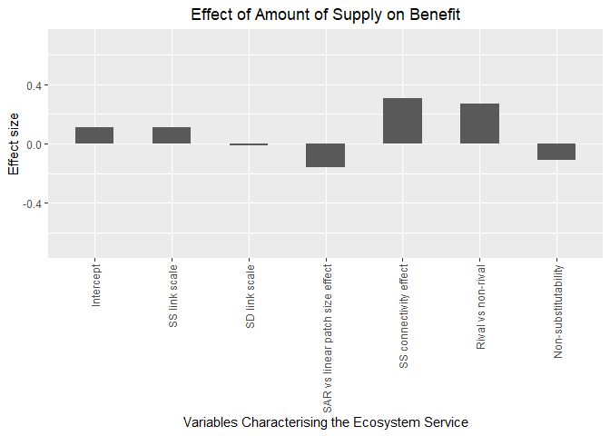<!-- -->

### Plot for amount of demand

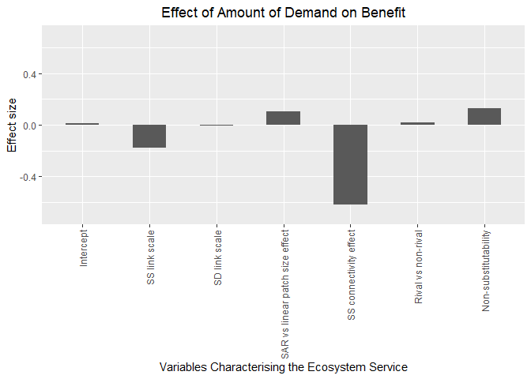<!-- -->

### Plot for amount of supply \* demand interaction

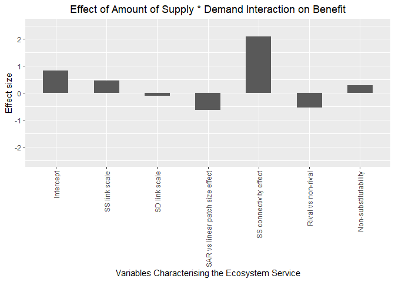<!-- -->

### Plot for fragmentation of supply

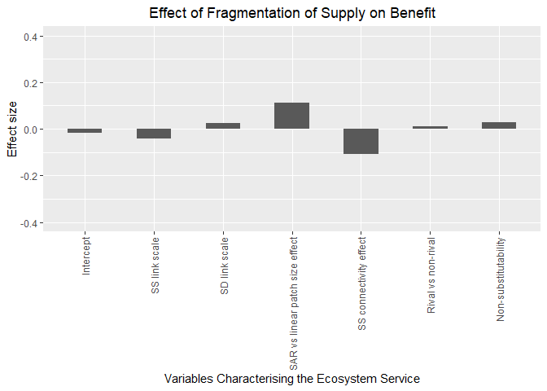<!-- -->

### Plot for fragmentation of demand

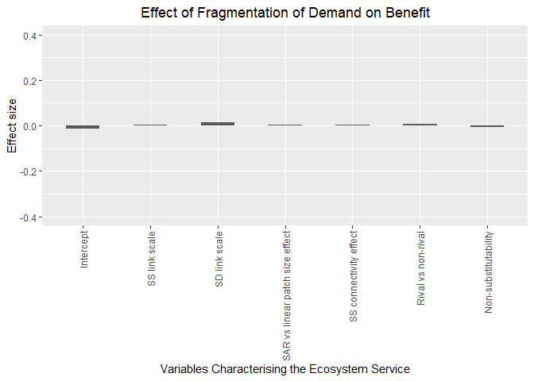<!-- -->

### Plot for fragmentation of supply \* demand interaction

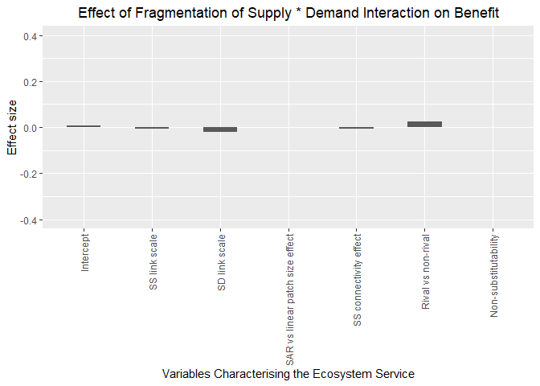<!-- -->

### Plot for number of supply nodes

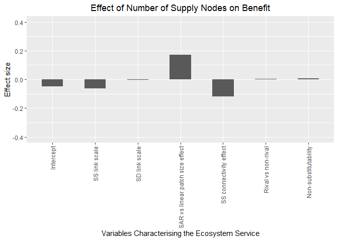<!-- -->

### Plot for number of demand nodes

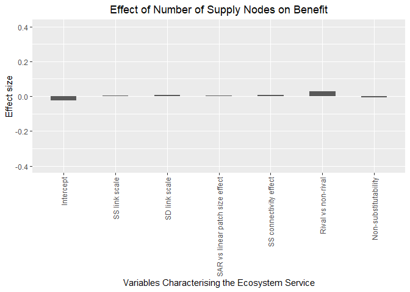<!-- -->

### Plot for number of supply \* demand nodes interaction

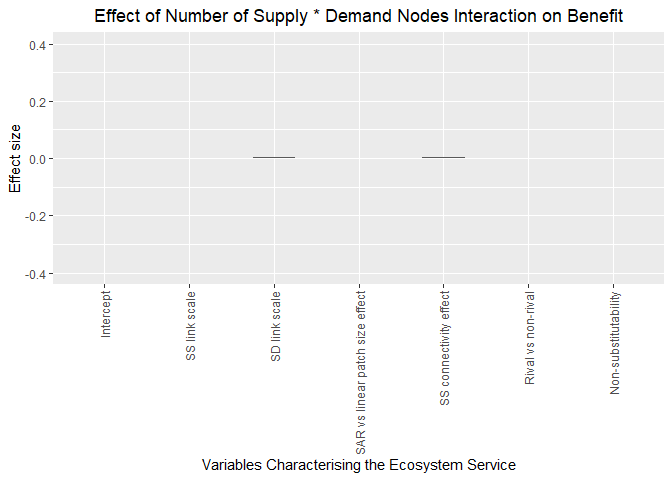<!-- -->

### Plot for supply-supply network density

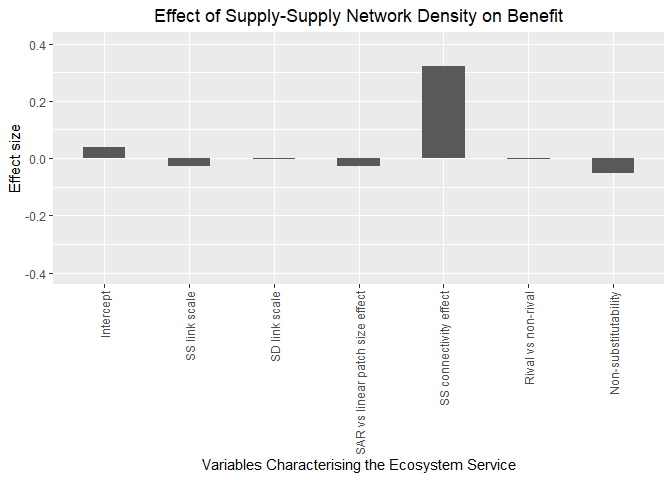<!-- -->

### Plot for supply-demand network density

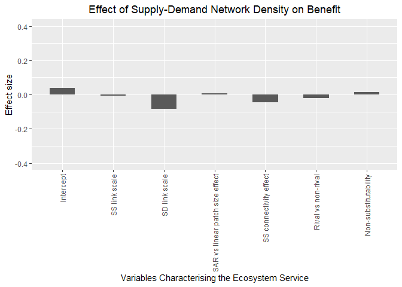<!-- -->

### Plot for supply-supply network centralisation

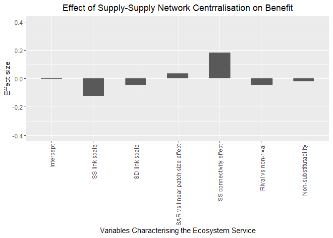<!-- -->

### Plot for supply-demand network centralisation (supply nodes only)

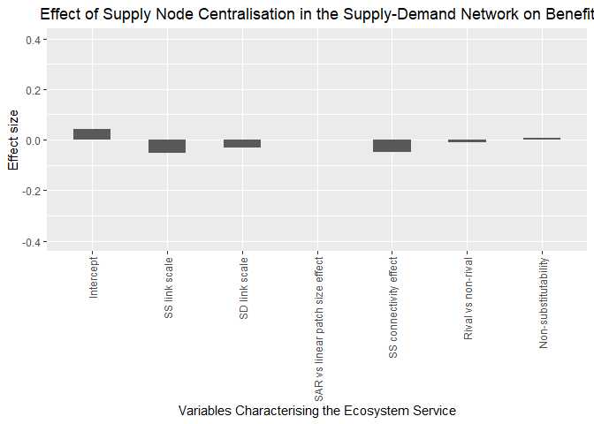<!-- -->

### Plot for supply-demand network centralisation (demand nodes only)

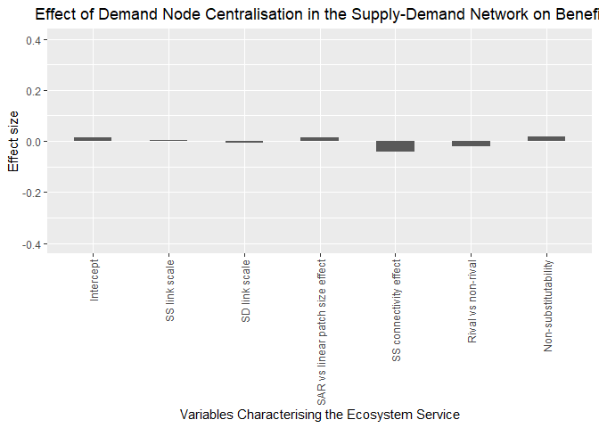<!-- -->
