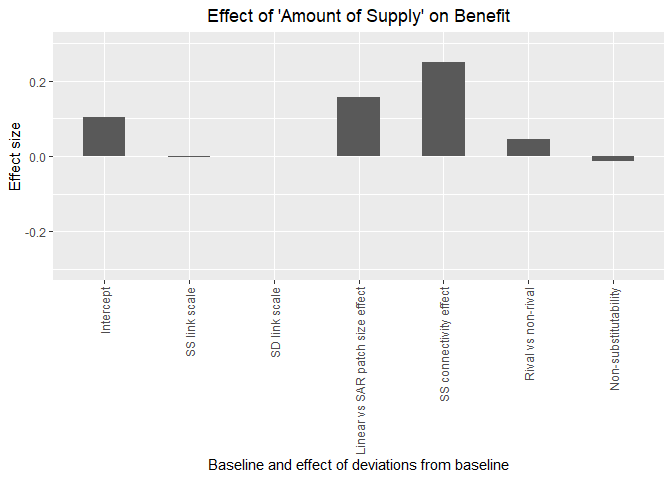
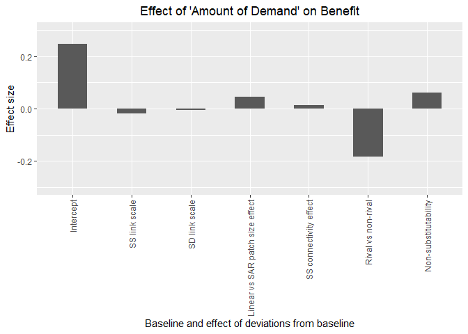
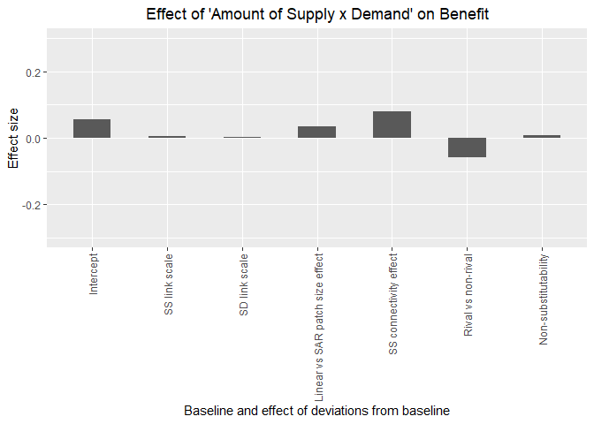
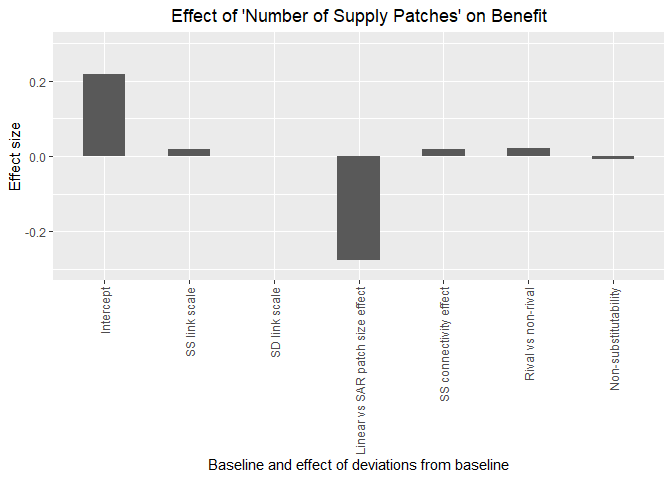
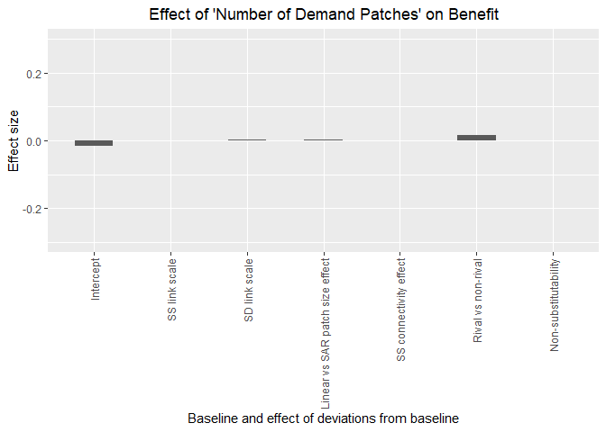
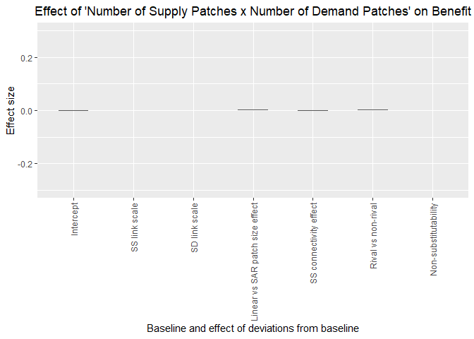
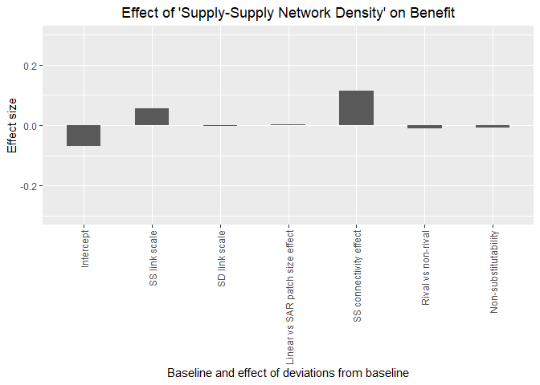
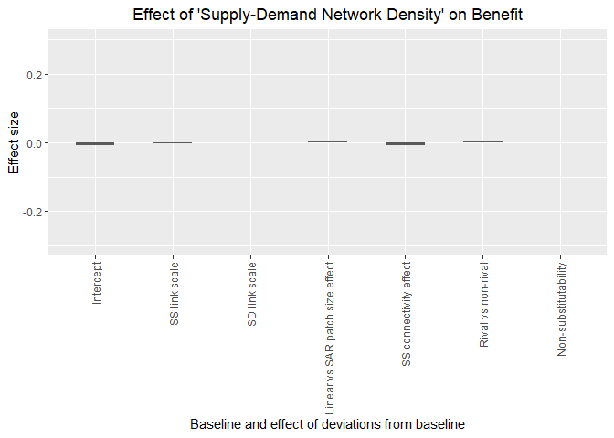
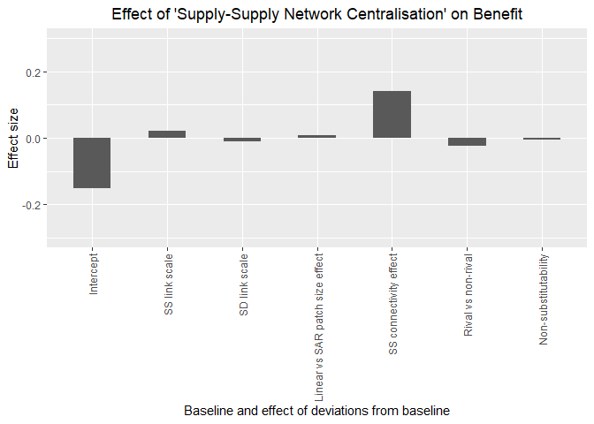
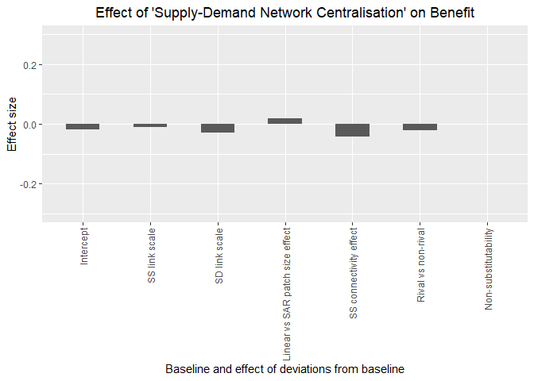

Simulation Analysis
================

## Introduction

In this document, we analyse the results of the simulations generated
using `es_benefit.R`.

## Data set-up

### Compile simulation results

``` r
#set eval = FALSE if results already compiled
f = list.files("results/benefit_replicates", full.names = TRUE)

read_rda = function(x) {
    load(x)
    return(out)
}

out = map_dfr(f, read_rda)

save(out, file = "results/all_replicates.rda")
```

### Load simulation results

``` r
#set eval = TRUE if results not compiled above
load("results/all_replicates.rda")
```

### Manipulate simulation data

``` r
res <- out %>%
mutate(ee_thresh = as.factor(ee_thresh),
             es_thresh = as.factor(es_thresh),                                                              
             patch_size_effect = as.factor(alpha),
             ee_connectivity_effect = as.factor(beta),           
             rivalness = as.factor(rival),
             substitutability = as.factor(gamma),
             size_supply = p_supply / num_supply,
             size_demand = p_demand / num_demand) %>%
select(benefit, supply, p_supply, p_demand, f_supply, f_demand, num_supply, num_demand, size_supply, size_demand, ee_density, es_density, ee_centr_degree, es_centr_degree, ee_thresh, es_thresh, patch_size_effect, ee_connectivity_effect, rivalness, substitutability)

#tidy up memory
rm(out)
invisible(gc(verbose = FALSE))

#group simulations by the factors
group_res <- res %>%
  group_by(ee_thresh, es_thresh, patch_size_effect, ee_connectivity_effect, rivalness, substitutability) %>%
  nest()

#tidy up memory
rm(res)
invisible(gc(verbose = FALSE))
```

## Model fitting

Here we first develop path models based on the conceptualisation of the
relationships between the amount of supply and demand and network
metrics represented in the figure below.

<!-- -->

Then we develop a linear model to explain the total effects (direct and
indirect) of each variable in the figure above as a function of: (1) the
spatial scale of supply-supply links, (2) the spatial scale of the
supply-demand links,(3) whether the effect of patch size on supply is
linear, or follows a species-area relationship (SAR), (4) the size and
direction of the effect of supply-supply links, (5) whether the
ecosystem service is rival or non-rival, and (6) the degree of
non-substitutability of the ecosystem service.

### Define function to fit the path models

``` r
fit_sem <- function(dat, model) {
    sem(model, data = dat)
}
```

### Define path model structure

``` r
#change here to change model structure
path_mod <- '
                        #regressions
                        benefit ~  alpha1 * p_supply + alpha2 * p_demand +  + alpha3 * p_demand:p_supply + alpha4 * num_supply + alpha5 * ee_density + alpha6 *  ee_centr_degree + alpha7 * num_demand + alpha8 * es_density + alpha9 * es_centr_degree
                        ee_density ~ beta1 * num_supply
                        ee_centr_degree ~ beta2 * ee_density
                        es_density ~ gamma1 * num_supply + gamma2 * num_demand + gamma3 * num_supply:num_demand
                        es_centr_degree ~ gamma4 * es_density

                        #direct and indirect effects
                        total_s := alpha1
                        total_d := alpha2
                        total_sd := alpha3
                        total_ns := alpha4 + beta1 * alpha5 + beta1 * beta2 * alpha6
                        total_nd := alpha7 + gamma2 * alpha8 + gamma2 * gamma4 * alpha9
                        total_nsnd := gamma3 * alpha8 + gamma3 * gamma4 * alpha9
                        total_ssden := alpha5 + beta2 * alpha6
                        total_sdden := alpha8 + gamma4 * alpha9
                        total_sscen := alpha6
                        total_sdcen := alpha9                               
'
```

### Define function to return total effects of each variable

``` r
#change here for different model structures
get_estimates <- function(model) {
    as_tibble(filter(parameterEstimates(model),label=="total_s" | label=="total_d" | label=="total_sd" | label=="total_ns" | label=="total_nd"
                    | label=="total_nsnd" | label=="total_ssden" | label=="total_sdden" | label=="total_sscen" | label=="total_sdcen")) %>%
                        select(label, est, se, ci.lower, ci.upper)
}
```

### Define function to fit linear model to explain effects in the path models

``` r
#change here for different model structures
fit_lm <- function(data) {
    lm(est ~ ee_thresh + es_thresh + patch_size_effect + ee_connectivity_effect + rivalness + substitutability, data = data)
}
```

### Run the analysis

``` r
#check for collinearity
cor(select(group_res$data[[1]],c(num_supply, num_demand, p_supply, p_demand, ee_density, ee_centr_degree, es_density,  es_centr_degree)),               use="complete.obs", method=c("spear"))
```

    ##                    num_supply    num_demand      p_supply      p_demand
    ## num_supply       1.000000e+00 -0.0001795755 -9.658875e-06 -0.0001144209
    ## num_demand      -1.795755e-04  1.0000000000  2.179318e-04  0.0171418619
    ## p_supply        -9.658875e-06  0.0002179318  1.000000e+00 -0.0004365245
    ## p_demand        -1.144209e-04  0.0171418619 -4.365245e-04  1.0000000000
    ## ee_density      -8.751618e-01  0.0009898949 -1.207862e-02 -0.0014638712
    ## ee_centr_degree  5.943258e-01 -0.0016460911  3.455926e-01 -0.0003605729
    ## es_density      -2.575584e-01 -0.1689191792  1.974572e-02  0.0298159706
    ## es_centr_degree  8.805499e-02 -0.0172739487  1.531275e-01  0.1672774970
    ##                    ee_density ee_centr_degree  es_density es_centr_degree
    ## num_supply      -0.8751617941    0.5943257800 -0.25755843      0.08805499
    ## num_demand       0.0009898949   -0.0016460911 -0.16891918     -0.01727395
    ## p_supply        -0.0120786155    0.3455925611  0.01974572      0.15312748
    ## p_demand        -0.0014638712   -0.0003605729  0.02981597      0.16727750
    ## ee_density       1.0000000000   -0.5533132154  0.24973318     -0.04103495
    ## ee_centr_degree -0.5533132154    1.0000000000 -0.10968939      0.09448518
    ## es_density       0.2497331828   -0.1096893854  1.00000000     -0.68706496
    ## es_centr_degree -0.0410349545    0.0944851819 -0.68706496      1.00000000

``` r
#fit the path models
path_models <-  group_res %>%   mutate(data_scaled = map(data, scale),
             mod = map(.x = data_scaled, .f = fit_sem, model = path_mod),
                     effects = map(mod, get_estimates))

#re-arrange data
path_data <- path_models %>% select(-data, -data_scaled, -mod) %>% unnest() %>% group_by(label) %>%
                                    mutate(ee_thresh = scale(as.numeric(as.character(ee_thresh))), es_thresh = scale(as.numeric(as.character(es_thresh))),
                                    ee_connectivity_effect = scale(as.numeric(as.character(ee_connectivity_effect))),
                                    substitutability = scale(as.numeric(as.character(substitutability)))) %>% nest()

#fit linear models to explain path coefficients
linear_models <- path_data %>% mutate(lm_est = map(.x = data, .f = fit_lm)) %>% mutate(coefs = map(.x = lm_est, .f = coef))                  
```

## Plot results

In all the plots below, the baseline service is one where: (1) the scale
of supply and demand links is around half the landscape size, (2) patch
size effects on supply follow a species area relationship, (3)
supply-supply connectivity effect is zero, (4) the service is non-rival,
and (5) the service is moderately substitutable. The effect of
deviations from this baseline are shown.

### Effect of amount of supply on benefit

In the figure below, the baseline effect of the amount of supply on
benefit is positive (intercept) and this effect becomes more positive
with: (1) linear versus SAR patch size effects, (2) the effect of
supply-supply connections becoming more positive, and (3) rival versus
non rival.

<!-- -->

### Effect of amount of demand on benefit

In the figure below, the baseline effect of the amount of demand on
benefit is positive (intercept) and this effect becomes more positive
with: (1) linear versus SAR patch size effects, and (2) increased
non-substitutability, and this effect becomes less positive with: (1)
increased non-substitutability.

<!-- -->

### Effect of amount of supply x amount of demand on benefit

In the figure below, the baseline effect of the amount of supply x
amount of demand (i.e., interaction) on benefit is positive (intercept)
and this effect becomes more positive with: (1) linear versus SAR patch
size effects, and (2) the effect of supply-supply connections becoming
more positive, and this effect becomes less positive with: (1) rival
versus
non-rival.

<!-- -->

### Effect of number of supply patches on benefit

In the figure below, the baseline effect of the number of supply patches
on benefit is positive (intercept) and this effect becomes less positive
with: (1) linear versus SAR patch size
effects.

<!-- -->

### Effect of number of demand patches on benefit

In the figure below, the effect of the number of demand patches on
benefit is small but, the baseline effect of the number of demand
patches on benefit is negative (intercept) and this effect becomes less
negative with: (1) rival versus
non-rival.

<!-- -->

### Effect of number of supply patches x number of demand patches on benefit

In the figure below, the effect of the number of supply patches x the
number of demand patches on benefit is very
small.

<!-- -->

### Effect of supply-supply network density on benefit

In the figure below, the effect of the supply-supply network density is
small, but the baseline effect of the supply-supply network density is
negative (intercept) and this effect becomes less negative with: (1)
increasing scale of the supply-supply links, and (2) the effect of
supply-supply connections becoming more
positive.

<!-- -->

### Effect of supply-demand network density on benefit

In the figure below, the effect of the supply-demand network density is
very
small.

<!-- -->

### Effect of supply-supply network centralisation on benefit

In the figure below, the baseline effect of the supply-supply network
centralisation is negative and this effect becomes less negative with:
(1) the effect of supply-supply connections becoming more positive.

<!-- -->

### Effect of supply-demand network centralisation on benefit

In the figure below, the effect of the supply-demand network
centalisation is small, but the baseline effect of the supply-demand
network centralisation is negative (intercept) and this effect becomes
less negative with: (1) linear versus SAR patch size effects, and more
negative with: (1) increasing scale of the supply-supply links, (2)
increasing scale of the supply-demand links, (3) the effect of
supply-supply connections becoming more positive, and (4) rival versus
non-rival.

<!-- -->
