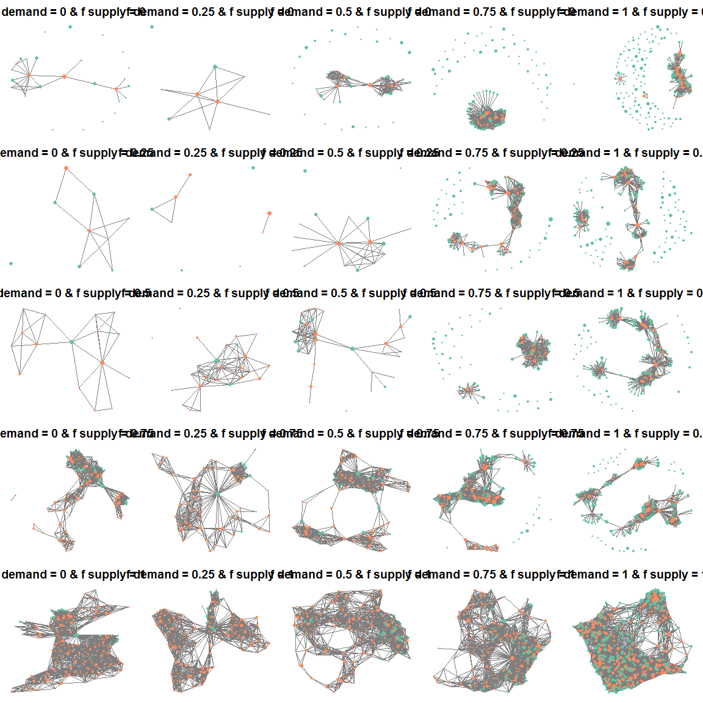

In this document we can do the main analysis for the simulated landscapes examples, from simulating the landscapes through to analysing via equations and motifs. Any underlying functions can be saved in the `R` folder, and be called using `source(function_file.R)`. The outline of the workflow is as follows:

1. Simulate landscapes with the following parameters:

      * `p_supply`: proportion of the landscape which is ES supply
      * `p_demand`: proportion of the landscape which is ES demand
      * `f_supply`: the fragmentation level of the ES supply (in the range [0, 1] with 1 being the most fragmented)
      * `f_demand`: the fragmentation level of the ES demand (in the range [0, 1] with 1 being the most fragmented)
      * `inter`: the interpersion between ES supply and demand (in the range [0, 1] with 1 being completely interspersed)

We will have landscapes for a range of each parameter, and for each parameter combination we will generate 100 replicates.

2. Generate a distance matrix and an attribute data frame from each simulated landscape. The distance matrix will contain Euclidean distances between every supply and demand patch within the landscape (supply-supply, demand-demand, supply-demand). The attribute table will contain the following columns:

      * `ID`: the patch identity to link back to the distance matrix
      * `patch_type`: whether the patch is supply or demand
      * `patch_area`: the size of the patch

    Here we also generate a discrete networks for the network analysis based on the following parameters (we assume no demand-demand links):

      * `ee_link`: TRUE/FALSE indicating presence or absence of ecological-ecological links
      * `ee_threshold`: distance threshold for ecological-ecological links
      * `se_threshold`: distance threshold for social-ecological links

3. Calculate ES benefit for the landscape based on the network

4. Perform motif analysis to identify frequency of motifs

5. Compare landscape structure parameters, ES benefits and motif frequencies

# Simulate landscapes

We have created a function `ls_create` which simulates social-ecological landscapes for a given amount and fragmentation of supply and demand, and interspersion between the two. Our simulated landscapes are built up from three neutral landscape models (NLM): 

- supply landscape: a fractal Brownian motion NLM where we control the amount (`p_supply`) and configuration (`f_supply`)
- demand landscape: a fractal Brownian motion NLM where we control the amount (`p_demand`) and configuration (`f_demand`)
- a gradient landscape: a planar gradient NLM

The final social-ecological landscape is then created using the following steps: 

- merge supply and demand landscapes (equal weighting to both)
- merge the above landscape with the gradient landscape (here, the weighting controls the level of interspersion using the parameter `inter`: 

  - 0 --> social and ecological patches as interspersed as the p/f parameters will allow
  - 1 --> social and ecological patches as segregated as the p/f parameters will allow)

For simplicity, we currently are not simulating supply/demand patches. 

The initial simulated landscapes will use all combinations of the following range of parameters:

- `p_supply` and `p_demand`: fixed at 0.15
- `f_supply` and `f_demand`: 0.1, 0.5, 1 (from high to low fragmentation)
- `inter`: 0, 0.5, 1

This gives us a total of 27 simulated landscapes. At the moment we have 1 of each landscape, but for analysis we should generate replicates (100?) of each.

The below figure provides an illustration of one iteration of the landscapes:

<!-- -->

# Network, distance and attribute tables

Next step is to create the distance matrix, and table which includes `ID`, `patch_code` (0 = neutral, 1 = supply, 2 = demand, 3 = supply/demand), `patch_area` for each simulated landscape. We will also include the parameters used to generate the landscape on the attribute table, for ease of analysis.

Here we also create a discrete social-ecological network based on the distance thresholds between supply-supply nodes (ecological-ecological links) and supply-demand links (social-ecological links). For this we need to define whether ecological-ecological links exist, and the distance thresholds for each type of link, as follows:  

- `ee_link`: TRUE/FALSE indicating presence or absence of ecological-ecological links
- `ee_threshold`: distance threshold for ecological-ecological links
- `se_threshold`: distance threshold for social-ecological links

This is where we also generate network format for fanmod. For the fanmod file outputs, there are 4 columns (as per the expected fanmod input for coloured vertices): int1 = id of node one, int2 = id of node two, int3 = type of node one, int4 = type of node two.

The below figure provides an illustration of one iteration of the networks:

<!-- -->

# ES benefit calculation

Next step is to generate the benefits based on the distance type node type metric. Note here that at present we discretise the network based on a distance threshold for the social-ecological and ecological-ecological links and then calculate the benefit based on this network     

# Network motif analysis

# Equation and motif comparison

